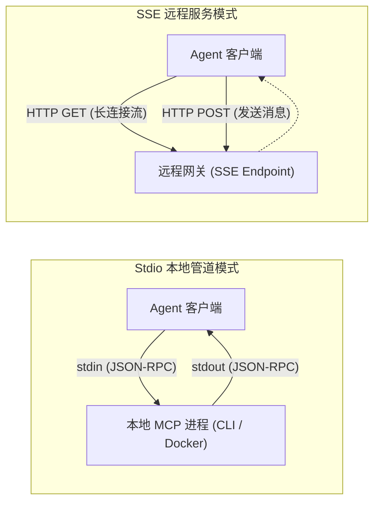

# 多客户端统一接入指南

Model Context Protocol (MCP) 作为开放标准协议，已获得大模型与智能编程助手生态的广泛支持。本文档全面介绍如何将 **Ateng MCP 服务矩阵** 无缝挂载至主流智能体客户端（Claude Desktop、Cursor、Cline、Google Antigravity 等），并提供协议传输规范、安全机密注入及全链路故障排查指南。

---

## 1. 协议通信传输模式 (Transport Modes)

MCP 定义了两种核心传输适配协议，满足不同拓扑场景的集成需求：



<div style="display: flex; gap: 8px; flex-wrap: wrap; margin: 16px 0;">
  <VpBadge type="tip">Stdio 模式</VpBadge>
  <VpBadge type="purple">SSE 模式</VpBadge>
</div>

### 1.1 Stdio 模式 (标准输入输出)
- **原理**：Agent 客户端直接作为父进程拉起本地 CLI 或容器，通过标准输入（`stdin`）与标准输出（`stdout`）进行全双工 JSON-RPC 2.0 报文交互；
- **适用场景**：本地开发环境、单机调试、通过 Docker 容器本地运行的服务端；
- **核心优势**：零网络端口监听暴露，生命周期随客户端开启/关闭自动纳管；
- **注意事项**：**严禁在服务端主干逻辑中向 `stdout` 输出非 JSON 字符串（如裸 `console.log`、Banner 图案等）**，任何非标准报文都会破坏通信管道并导致客户端挂死。

### 1.2 SSE 模式 (Server-Sent Events)
- **原理**：基于 HTTP 协议，客户端向服务端发起 GET 请求建立单向持续事件流，同时通过单独的 HTTP POST 端点发送操作请求；
- **适用场景**：私有云集群、K8s Pod 统一托管、跨机器局域网共享、具备集中鉴权网关的企业级中台；
- **核心优势**：支持集中化统一高可用治理与监控，便于多客户端共享同一持久化服务端实例。

---

## 2. 主流 Agent 客户端接入配置

### 2.1 Claude Desktop

Anthropic 官方客户端通过集中式 JSON 配置文件管理 MCP 服务列表。

#### 配置文件路径
- **Windows**：%APPDATA%\Claude\claude_desktop_config.json
- **macOS**：`~/Library/Application Support/Claude/claude_desktop_config.json`
- **Linux**：`~/.config/Claude/claude_desktop_config.json`

#### 配置示例 (`claude_desktop_config.json`)

```json
{
  "mcpServers": {
    "rocketmq-control": {
      "command": "java",
      "args": ["-jar", "rocketmq-mcp-server.jar"],
      "env": {
        "ROCKETMQ_NAMESRV_ADDR": "127.0.0.1:9876"
      }
    },
    "s3-storage": {
      "command": "uvx",
      "args": ["ateng-s3-mcp"],
      "env": {
        "AWS_ENDPOINT_URL": "http://127.0.0.1:9000",
        "AWS_ACCESS_KEY_ID": "admin",
        "AWS_SECRET_ACCESS_KEY": "${SERVICE_PASSWORD}"
      }
    },
    "remote-gateway": {
      "url": "http://mcp-gateway.internal:8080/sse"
    }
  }
}
```

---

### 2.2 Cursor

Cursor 深度集成了 MCP 协议，支持项目级配置文件或全局设置面板中声明。

#### 项目级配置路径
在当前代码库根目录下创建或编辑 `.cursor/mcp.json`：

```json
{
  "mcpServers": {
    "kubernetes-ops": {
      "command": "ateng-k8s-mcp",
      "args": ["--kubeconfig", "~/.kube/config"],
      "env": {
        "K8S_READONLY_MODE": "true"
      }
    },
    "kafka-mcp": {
      "command": "uvx",
      "args": ["ateng-kafka-mcp"],
      "env": {
        "KAFKA_BOOTSTRAP_SERVERS": "127.0.0.1:9092"
      }
    }
  }
}
```

> [!TIP] 协同提交建议
> 将项目特定的 `.cursor/mcp.json` 纳入 Git 版本控制，团队成员拉取代码后即可直接共享该项目的 MCP 工具拓扑。

---

### 2.3 Cline (VS Code 扩展)

Cline（前身为 Claude Dev）为 VS Code 用户提供了极简的 MCP 托管生态。

#### 配置文件路径
打开 VS Code 设置或通过 Cline 顶栏 MCP 图标直接打开 `cline_mcp_settings.json`：
- **Windows**：%APPDATA%\Code\User\globalStorage\saoudrizwan.claude-dev\settings\cline_mcp_settings.json
- **macOS**：`~/Library/Application Support/Code/User/globalStorage/saoudrizwan.claude-dev/settings/cline_mcp_settings.json`

#### 配置示例 (`cline_mcp_settings.json`)

```json
{
  "mcpServers": {
    "email-tools": {
      "command": "npx",
      "args": ["-y", "ateng-email-mcp"],
      "env": {
        "SMTP_HOST": "smtp.example.com",
        "SMTP_PORT": "465",
        "SMTP_USER": "agent@example.com",
        "SMTP_PASS": "${SERVICE_PASSWORD}"
      },
      "disabled": false,
      "autoApprove": [
        "email_list_unread",
        "email_search"
      ]
    },
    "rabbitmq-tools": {
      "command": "npx",
      "args": ["-y", "ateng-rabbitmq-mcp"],
      "env": {
        "RABBITMQ_MANAGEMENT_URL": "http://127.0.0.1:15672",
        "RABBITMQ_USERNAME": "guest",
        "RABBITMQ_PASSWORD": "${SERVICE_PASSWORD}"
      }
    }
  }
}
```

---

### 2.4 Google Antigravity

Google Antigravity 体系原生支持按目录分治与全局配置双模式挂载 MCP 服务。

#### 挂载模式与结构
Antigravity 会扫描用户目录及插件配置树中的 MCP 服务，并支持将工具元数据与 Schema 集中放置于受管配置目录：

```
~/.gemini/antigravity/mcp/
├── rocketmq-dev/
│   ├── instructions.md        # 服务最佳实践与 Agent 操作指引
│   ├── rocketmq_cluster_status.json
│   └── rocketmq_consumer_lag.json
└── email/
    ├── instructions.md
    └── email_send.json
```

#### 全局 MCP 配置片段 (`mcp_config.json`)

```json
{
  "servers": {
    "kubernetes-agent": {
      "command": "ateng-k8s-mcp",
      "args": ["--context", "prod-cluster"],
      "env": {
        "K8S_READONLY_MODE": "true"
      }
    },
    "enterprise-s3": {
      "command": "uvx",
      "args": ["ateng-s3-mcp"],
      "env": {
        "AWS_REGION": "us-east-1"
      }
    }
  }
}
```

---

## 3. 环境变量与凭据安全注入规范

为防止数据库密码、API Token 及密钥误提交至版本控制库，接入时请严格遵守以下安全基线：

1. **零明文硬编码**：严禁在共享的配置文件中填入明文私钥。请利用各客户端提供的系统环境变量继承能力，或在本地未跟踪的私有环境变量文件中声明；
2. **只读保护优先**：在初次配置或开发环境中，优先为服务端开启只读安全开关（例如 `K8S_READONLY_MODE=true` 或 `ROCKETMQ_READONLY=true`）；
3. **白名单自动授权 (Auto-Approve)**：
   - 针对幂等、只读型工具（如 `list`、`status`、`inspect`），可在客户端配置中加入自动放行规则；
   - 针对高危或产生写操作的工具（如 `delete`、`purge`、`resend`），**必须保留人工审批卡点**。

---

## 4. 常见连接故障排查清单 (Troubleshooting)

| 故障现象 | 根因诊断 | 解决方案 |
| :--- | :--- | :--- |
| **`spawn ENOENT` 错误** | 客户端未在系统全局 `PATH` 中找到指定命令（如 `java`、`uvx`、`node`） | 使用绝对可执行文件路径替代简写，或在客户端环境配置中追加环境变量 `PATH`。 |
| **连接挂死 / JSON Parse Error** | 服务端代码在 Stdio 模式下向标准输出打印了非 JSON 日志（如调试文本或 Banner） | 检查服务端源码，将所有诊断日志改写为输出至 `stderr` 或专用本地日志文件。 |
| **SSE 401 / 403 鉴权失败** | 远程 MCP 服务端开启了 Bearer Token 或反向代理鉴权，客户端未携带请求头 | 在客户端配置中确认是否支持自定义 Headers 注入，或通过专用认证网关透传。 |
| **权限不足 (`EACCES`)** | 执行脚本或预编译二进制文件缺失执行权限 | 在终端中针对目标执行文件执行 `chmod +x <binary_path>`。 |
| **Tools 列表为空** | 客户端握手成功但未能正确协商工具 Schema | 检查服务端的 MCP SDK 版本是否兼容，使用官方 MCP Inspector 进行单独排查。 |

---

## 5. 官方调试工具 (MCP Inspector)

如遇到连接异常或工具调用返回不符合预期，推荐使用官方可视化检查工具独立拉起服务进行端到端测试：

```bash
# 使用 npx 启动官方 MCP Inspector 并在浏览器中调试
npx @modelcontextprotocol/inspector <command> <args...>
```

---

## 6. 相关指引

- 返回服务概览：[MCP 服务矩阵总览](../servers/index.md)
- 查看快速上手：[快速起步](./getting-started.md)
