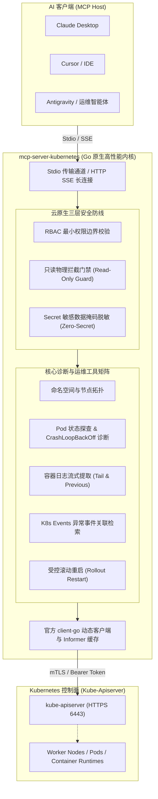

# Kubernetes 智能运维底座 MCP 服务

<div style="display: flex; gap: 8px; flex-wrap: wrap; margin: 16px 0;">
  <a href="https://github.com/atengk/mcp-server-kubernetes" target="_blank" rel="noopener noreferrer">
    
  </a>
  
  
  
  
</div>

`mcp-server-kubernetes` 是基于 **Go 原生内核与官方 client-go** 深度构建的企业级云原生智能运维与排障服务底座。它严格遵循 Model Context Protocol (MCP) 标准，为 AI 编程助手与自主运维 Agent（Claude Desktop、Cursor、Antigravity 等）赋予 Pod 极速排障、实时日志提取、告警事件关联分析与集群状态洞察能力。

---

## 1. 系统架构与安全设计



---

## 2. Tools 工具契约字典 (共 8 项)

| 模块分类 | 工具标识 (Tool Name) | 核心入参 (Parameters) | 职责与安全规范 |
| :--- | :--- | :--- | :--- |
| **拓扑与概览** | `k8s_list_namespaces` | *(无入参)* | 列出集群中所有命名空间及其状态（Active / Terminating） |
| | `k8s_list_nodes` | *(无入参)* | 检查集群所有物理/虚拟节点（Ready 状态、内核版本、CPU/内存容量与分配量） |
| **Pod 诊断** | `k8s_list_pods` | `namespace?`, `label_selector?`, `field_selector?` | 按命名空间或标签检索 Pod 列表（返回 Phase, IP, Node, 重启次数） |
| | `k8s_get_pod` | **`name`**, `namespace?` | 获取 Pod 完整规格与容器运行详情（Waiting 原因、ExitCode、OOM 标记） |
| **日志与排障** | `k8s_get_pod_logs` | **`name`**, `namespace?`, `container?`, `tail_lines?` *(默认 100)*, `previous?`, `timestamps?` | 读取容器日志（支持崩溃前容器历史日志提取，内容带安全截断） |
| | `k8s_list_events` | `namespace?`, `involved_object_name?`, `type?` | 检索集群异常事件流（Warning 告警、FailedScheduling、BackOff 事件检索） |
| **资源探查** | `k8s_get_resource` | **`api_version`**, **`kind`**, **`name`**, `namespace?` | 探查任意原生或 CRD 资源声明（**Secret 资源自动实施数据掩码脱敏**） |
| **自愈与运维** | `k8s_restart_rollout`| **`kind`** *(Deployment/StatefulSet/DaemonSet)*, **`name`**, `namespace?`, **`confirm: true`** | 声明式触发资源滚动更新（🚨 需显式确认且在只读模式下物理拦截） |

---

## 3. RBAC 最小权限与安全性防御

为了确保大模型在企业真实集群中的安全可控，推荐按照最小权限原则配置 RBAC：

### 推荐只读 ClusterRole 配置范例

```yaml
apiVersion: rbac.authorization.k8s.io/v1
kind: ClusterRole
metadata:
  name: mcp-k8s-viewer
rules:
  - apiGroups: [""]
    resources: ["namespaces", "nodes", "pods", "pods/log", "events", "services", "configmaps"]
    verbs: ["get", "list", "watch"]
  - apiGroups: ["apps"]
    resources: ["deployments", "statefulsets", "daemonsets"]
    verbs: ["get", "list", "watch"]
```

> [!CAUTION] 机密安全防御
> 服务端对 `Secret` 资源执行严格防御，即使 RBAC 授予了访问权，在通过 `k8s_get_resource` 读取时，所有的 `data` 与 `stringData` 键值均会被正向抽象替换为 `[REDACTED_SECRET]`，杜绝模型上下文泄露生产凭据。

---

## 4. 多客户端接入配置

### 4.1 Claude Desktop 配置 (`claude_desktop_config.json`)

```json
{
  "mcpServers": {
    "kubernetes": {
      "command": "npx",
      "args": ["-y", "@atengk/mcp-server-kubernetes"],
      "env": {
        "KUBECONFIG": "/home/user/.kube/config",
        "K8S_READ_ONLY": "true"
      }
    }
  }
}
```

### 4.2 Cursor 与 Antigravity 配置

在 `.cursor/mcp.json` 或 `~/.gemini/antigravity/mcp/` 中挂载：

```json
{
  "mcpServers": {
    "k8s-cluster": {
      "command": "npx",
      "args": ["-y", "@atengk/mcp-server-kubernetes"],
      "env": {
        "KUBECONFIG": "${HOME}/.kube/config",
        "K8S_DEFAULT_NAMESPACE": "default",
        "K8S_READ_ONLY": "true"
      }
    }
  }
}
```

---

## 5. 环境变量与配置参数全景

| 环境变量名 | 默认值 | 作用说明 |
| :--- | :--- | :--- |
| `KUBECONFIG` | `~/.kube/config` | Kubeconfig 认证配置文件绝对路径（集群外运行时） |
| `K8S_IN_CLUSTER` | `false` | 是否使用集群内部 ServiceAccount Pod Token 直接连接 |
| `K8S_DEFAULT_NAMESPACE` | `default` | 工具调用时未显式指定命名空间时的默认回退值 |
| `K8S_READ_ONLY` | `true` | 全局只读安全门禁开关（默认开启以保障集群安全） |
| `K8S_MAX_LOG_BYTES` | `65536` | 容器日志读取上限（字节，默认 64KB） |
| `MCP_TRANSPORT` | `stdio` | 协议传输模式 (`stdio` 或 `sse`) |
| `MCP_PORT` | `8080` | SSE 远程模式下的 HTTP 监听端口 |

---

## 6. 本地运行与 Docker 快速启动

```bash
# 1. 终端通过 npx 快速运行
npx -y @atengk/mcp-server-kubernetes --kubeconfig ~/.kube/config --read-only

# 2. Docker 挂载 Kubeconfig 启动
docker run -d \
  --name mcp-server-k8s \
  -p 8080:8080 \
  -v ~/.kube/config:/root/.kube/config:ro \
  -e K8S_READ_ONLY=true \
  ghcr.io/atengk/mcp-server-kubernetes:latest
```

---

## 7. 相关资源与互链

- 官方开源仓库：[atengk/mcp-server-kubernetes](https://github.com/atengk/mcp-server-kubernetes)
- 返回服务矩阵总览：[MCP 服务矩阵总览](../index.md)
- 客户端配置参考：[多客户端统一接入指南](../../guide/client-setup.md)
