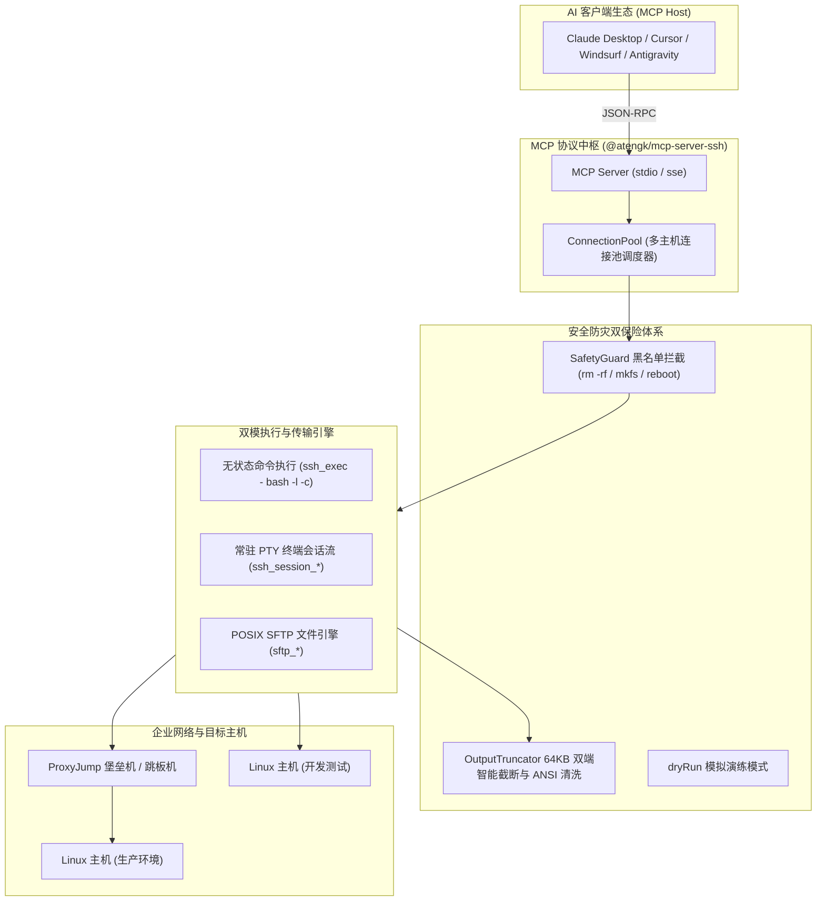

# OpenSSH 智能终端与 SFTP 服务

基于标准 **OpenSSH 协议** 深度连接与操控 Linux/Unix 系统的 **Model Context Protocol (MCP)** 官方服务，基于 **Node.js** 与 **TypeScript** 构建。

为大语言模型（LLM）和 AI 智能体（Claude Desktop、Cursor、Windsurf、Antigravity、Cline 等）提供安全、可控、零侵入的远程终端执行与 POSIX 文件系统管理基础设施。

---

## 1. 核心架构与设计特性



### 1.1 零侵入标准协议直连
- **目标机免装 Agent**：目标 Linux 主机仅需原生 OpenSSH 服务，绝不安装任何私有 Agent 或额外 HTTP 守护进程；
- **凭据链与企业拓扑**：支持密码认证、公私钥（`id_ed25519` / `id_rsa` / Base64 编码）、`~/.ssh/config` 别名继承以及企业级 **ProxyJump 堡垒机/跳板机隧道**。

### 1.2 双模命令执行引擎
- **无状态执行 (`ssh_exec`)**：单命令独立通道，默认包装为登录 Shell（`bash -l -c`）以完整继承用户环境变量与 `PATH`，精确捕获退出码、耗时与标准输出/错误；
- **交互式会话 (`ssh_session_*`)**：基于 PTY 伪终端维持常驻会话流，支持流式增量回显与 `\x03` (Ctrl+C) 中断控制信号。

### 1.3 严格安全防护双保险
- **前置安全守卫 (`SafetyGuard`)**：在命令下发前物理拦截系统全盘强删（`rm -rf /`）、磁盘覆写（`dd`/`mkfs`）、关机重启（`reboot`/`shutdown`）及 Fork 炸弹等致命破坏，支持 `dryRun` 演练模式；
- **智能防爆截断 (`OutputTruncator`)**：单次输出实施 64KB 双端智能截断（保留前 8KB 标头与后 56KB 最新日志），自动清洗 ANSI 终端转义符，保护大模型上下文窗口不被撑爆。

### 1.4 全功能 POSIX SFTP 管理
- 文本安全读写（内置 512KB 防撑爆阈值）、双向文件极速上传与下载、目录树浏览、POSIX 元数据获取与软链接防环保护（`maxDepth: 10`）。

---

## 2. 17 个核心工具契约字典 (Tools Contract)

所有操作均支持可选的 `connectionId` 参数，实现单 MCP 实例内的多主机动态路由调度：

| 分类 | 工具名称 | 参数契约 | 功能描述与安全约束 |
| :--- | :--- | :--- | :--- |
| **基础运维** | `ssh_ping` | `(message?: string)` | 检测 MCP 服务存活、版本及网络往返延迟 |
| **连接管理** | `ssh_connect` | `(host, port=22, username, password?, privateKey?, proxyJump?, sshConfigAlias?)` | 建立新 SSH 物理连接或依据配置别名载入 |
| | `ssh_disconnect` | `(connectionId: string)` | 安全关闭并移除指定的物理 SSH 连接通道 |
| | `ssh_list_connections` | `()` | 列出当前连接池中所有活跃连接及默认路由主机 |
| | `ssh_list_config_hosts` | `()` | 读取并列出本机 `~/.ssh/config` 中预设的所有别名 |
| **命令执行** | `ssh_exec` | `(command, connectionId?, cwd?, timeoutMs?, dryRun?, dangerouslySkipSafetyCheck?)` | 无状态执行远程命令（继承 PATH，支持 dryRun 与安全逃生门） |
| **持久终端** | `ssh_session_start` | `(connectionId?, cols?, rows?)` | 启动常驻交互式 PTY 伪终端会话流 |
| | `ssh_session_send` | `(sessionId, input, waitForMs?)` | 向 PTY 终端注入输入或控制信号（如 `\x03` Ctrl+C） |
| | `ssh_session_close` | `(sessionId)` | 优雅关闭指定的交互式终端会话并回收系统资源 |
| **文件系统** | `sftp_read_file` | `(remotePath, connectionId?, encoding?, maxBytes?)` | 读取远程文本文件（单次限制 512KB 防撑爆） |
| | `sftp_write_file` | `(remotePath, content, createDirectories?)` | 写入并覆盖远程文本文件（支持自动递归建父目录） |
| | `sftp_list_dir` | `(remotePath, connectionId?)` | 浏览远程目录，返回 POSIX 元数据列表 |
| | `sftp_stat` | `(remotePath, connectionId?)` | 获取指定远程文件或目录的详细 POSIX 状态 |
| | `sftp_mkdir` | `(remotePath, recursive?)` | 在远程主机上创建目录（默认递归 `mkdir -p`） |
| | `sftp_remove` | `(remotePath, recursive?)` | 删除远程文件或目录（支持级联删除与防环保护） |
| | `sftp_upload` | `(localPath, remotePath, connectionId?)` | 将宿主机本地文件极速上传至远程目标路径 |
| | `sftp_download` | `(remotePath, localPath, connectionId?)` | 将远程主机文件极速下载至宿主机本地目标路径 |

---

## 3. 安装与运行方式

### 3.1 方式 1：使用 `npx` 免安装直接运行（推荐）

```bash
npx -y @atengk/mcp-server-ssh
```

### 3.2 方式 2：使用 Docker 容器化运行

```bash
# 本地单次交互管道 (stdio)
docker run -i --rm -e MCP_SSH_HOST="192.168.1.100" -e MCP_SSH_USER="root" -e MCP_SSH_PASSWORD="YOUR_PASSWORD" ghcr.io/atengk/mcp-server-ssh:latest

# 后台守护进程常驻 (SSE 远程端点)
docker run -d --name mcp-ssh -p 8000:8000 -e MCP_SSH_TRANSPORT=sse -e MCP_SSH_HOST="192.168.1.100" -e MCP_SSH_USER="root" -e MCP_SSH_PASSWORD="YOUR_PASSWORD" ghcr.io/atengk/mcp-server-ssh:latest
```

---

## 4. MCP 客户端配置模版

### 4.1 场景 1：密码账密直连 (Stdio 模式)

```json
{
  "mcpServers": {
    "ssh": {
      "command": "npx",
      "args": ["-y", "@atengk/mcp-server-ssh"],
      "env": {
        "MCP_SSH_HOST": "192.168.1.100",
        "MCP_SSH_PORT": "22",
        "MCP_SSH_USER": "root",
        "MCP_SSH_PASSWORD": "YOUR_SSH_PASSWORD"
      }
    }
  }
}
```

### 4.2 场景 2：公私钥免密直连 (生产环境推荐)

```json
{
  "mcpServers": {
    "ssh-prod": {
      "command": "npx",
      "args": ["-y", "@atengk/mcp-server-ssh"],
      "env": {
        "MCP_SSH_HOST": "192.168.1.100",
        "MCP_SSH_PORT": "22",
        "MCP_SSH_USER": "root",
        "MCP_SSH_KEY_PATH": "/Users/admin/.ssh/id_ed25519"
      }
    }
  }
}
```

> [!TIP] 容器与跨平台免文件挂载
> 在容器或无物理私钥文件环境中，可直接将私钥 Base64 编码字符串赋值给 `MCP_SSH_PRIVATE_KEY_BASE64`，服务将自动解码，避免文件挂载开销与换行丢失。

### 4.3 场景 3：直接复用本地 `~/.ssh/config` 别名

```json
{
  "mcpServers": {
    "ssh-config": {
      "command": "npx",
      "args": ["-y", "@atengk/mcp-server-ssh"],
      "env": {
        "MCP_SSH_CONFIG_ALIAS": "my-cloud-vps"
      }
    }
  }
}
```

### 4.4 场景 4：企业级 ProxyJump 堡垒机/跳板机穿透

```json
{
  "mcpServers": {
    "ssh-bastion": {
      "command": "npx",
      "args": ["-y", "@atengk/mcp-server-ssh"],
      "env": {
        "MCP_SSH_HOST": "10.0.1.50",
        "MCP_SSH_PORT": "22",
        "MCP_SSH_USER": "deploy",
        "MCP_SSH_PROXY_HOST": "bastion.company.com",
        "MCP_SSH_PROXY_PORT": "2222",
        "MCP_SSH_PROXY_USER": "bastion_user"
      }
    }
  }
}
```

---

## 5. 环境变量完整速查矩阵

| 环境变量 | 宽容兼容变量 | 默认值 | 作用描述 |
| :--- | :--- | :--- | :--- |
| `MCP_SSH_TRANSPORT` | `SSH_TRANSPORT` | `stdio` | 传输协议模式（`stdio` 或 `sse`） |
| `MCP_SSH_HOST` | `SSH_HOST` | 无 | 目标主机 IP 或域名 |
| `MCP_SSH_PORT` | `SSH_PORT` | `22` | SSH 服务端口号 |
| `MCP_SSH_USER` | `SSH_USER` | 系统当前用户 | 登录用户名 |
| `MCP_SSH_PASSWORD` | `SSH_PASSWORD` | 无 | 登录密码（输出中强制脱敏掩码） |
| `MCP_SSH_KEY_PATH` | `SSH_KEY_PATH` | 无 | 本地私钥绝对或 `~` 家目录路径 |
| `MCP_SSH_PRIVATE_KEY_BASE64` | `SSH_PRIVATE_KEY_BASE64` | 无 | Base64 编码私钥（彻底避免换行丢失） |
| `MCP_SSH_CONFIG_ALIAS` | `SSH_CONFIG_ALIAS` | 无 | 继承本机 `~/.ssh/config` 别名 |
| `MCP_SSH_PROXY_HOST` | `SSH_PROXY_HOST` | 无 | ProxyJump 堡垒机/跳板机地址 |
| `MCP_SSH_PROXY_PORT` | `SSH_PROXY_PORT` | `22` | 跳板机端口号 |
| `MCP_SSH_TIMEOUT` | `SSH_TIMEOUT` | `30000` | 建立连接超时时间（毫秒） |
| `MCP_SSH_ALLOW_DANGEROUS_COMMANDS` | `SSH_ALLOW_DANGEROUS_COMMANDS` | `false` | 致命高危命令安全逃生门 |

---

## 6. 相关指引

- 查看 Kubernetes 云原生底座：[Kubernetes 智能运维](./kubernetes.md)
- 返回服务矩阵全景：[MCP 服务矩阵总览](../index.md)
- 多客户端配置速查：[多客户端统一接入指南](../../guide/client-setup.md)
