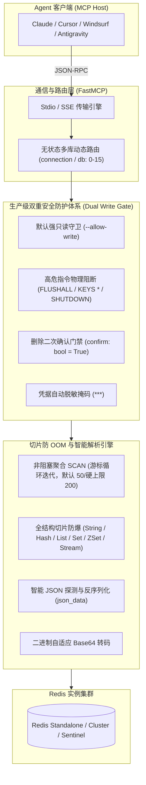

# Redis 生产级缓存与运维诊断服务

专为大语言模型（LLM）与智能体打造的高性能、安全可控的生产级 **Redis 模型上下文协议 (Model Context Protocol, MCP)** 官方服务，基于 **Python** 与 **FastMCP** 现代化架构构建。

为大模型提供工业级强只读防护、双重写门禁、单键多维诊断、全数据结构防 OOM 切片读取、慢查询审计与运维诊断能力。

---

## 1. 核心架构与设计特性



### 1.1 生产级双重安全防护体系 (Dual Write Gate)
- **默认强只读守卫**：服务默认处于全局只读模式，写操作（SET / DEL / EXPIRE）受启动参数 `--allow-write` 显式管控，且目标连接声明必须非 `readonly`；
- **高危指令物理阻断**：底层硬编码切断 `FLUSHALL`、`FLUSHDB`、`SHUTDOWN`、`CONFIG`、`DEBUG` 及阻塞式 `KEYS *`；
- **高危删除二次确认门禁**：`redis_delete_keys` 强制携带 `confirm: bool = False` 参数，未确认时仅返回受影响预估，显式传入 `confirm=True` 方可执行物理删除；
- **凭据掩码自动脱敏**：对外连接清单及日志输出中自动将 Redis 密码脱敏为 `***`，彻底杜绝凭据泄露。

### 1.2 非阻塞聚合与全数据结构切片防御
- **非阻塞安全聚合扫描**：内部自动循环迭代 `SCAN` 游标聚合返回，默认最多 50 条，单次硬上限 200 条；
- **全集合切片防 OOM 防御**：全面覆盖 **String**、**Hash**、**List**、**Set**、**Sorted Set (ZSet)**、**Stream** 六大结构，所有探查强制实施跨度截断；
- **智能 JSON 探测 (Smart JSON Parsing)**：遇到合法的 JSON 文本自动转换为结构化字典/列表对象（`json_data`），大幅削减大模型二次处理开销；
- **二进制自适应转码**：非文本二进制数据自动转换为 Base64 编码并标明 `is_binary: True`，绝不发生解码崩溃。

### 1.3 大 Key、内存占用与慢查询诊断
- 一站式获取 Key 的类型、存活时间（TTL / PTTL）、内存占用大小（`MEMORY USAGE`）与底层编码格式（`OBJECT ENCODING`）；
- 结构化提取 `INFO` 运行时系统指标、`SLOWLOG` 慢日志明细与当前连接客户端 `CLIENT LIST`。

---

## 2. 18 个核心工具契约字典 (Tools Contract)

服务精炼封装了 18 个高内聚原子工具，覆盖连接、键空间、数据读取、受控变更与运维诊断：

| 分类 | 工具名称 | 参数契约 | 功能描述与安全约束 |
| :--- | :--- | :--- | :--- |
| **实例与连接** | `redis_list_connections` | `()` | 查看所有已配置的 Redis 连接别名、脱敏 URL 及当前默认连接 |
| | `redis_ping` | `(connection=None, db=None)` | 健康探活，度量网络往返延迟 (RTT) 与服务状态 |
| | `redis_info` | `(section=None, connection=None, db=None)` | 结构化获取系统运行指标（server/memory/stats/clients 等） |
| | `redis_dbsize` | `(connection=None, db=None)` | 查询指定数据库中存储的键总数规模 |
| **键空间探查** | `redis_scan_keys` | `(pattern="*", limit=50, type=None, connection=None, db=None)` | 智能聚合扫描匹配键名，循环迭代游标并支持类型过滤与条数上限 |
| | `redis_key_inspect` | `(key: str, connection=None, db=None)` | 一站式综合诊断单键：类型、TTL、内存占用字节及底层编码 |
| | `redis_key_ttl` | `(key: str, connection=None, db=None)` | 轻量低延迟查询单个键的存活剩余时间 |
| **数据读取** | `redis_get_string` | `(key: str, parse_json=True, connection=None, db=None)` | 读取字符串键值（支持智能 JSON 解析与二进制 Base64 转码） |
| | `redis_hash_get` | `(key: str, fields=None, count=50, connection=None, db=None)` | 读取 Hash 字典指定字段或分页安全采样（大表切片防御） |
| | `redis_list_range` | `(key: str, start=0, stop=49, connection=None, db=None)` | 分页切片读取 List 列表元素（单次最大跨度上限 100） |
| | `redis_set_members` | `(key: str, count=50, connection=None, db=None)` | 采样读取 Set 集合元素（支持数量安全截断） |
| | `redis_zset_range` | `(key: str, start=0, stop=49, withscores=True, connection=None, db=None)` | 读取 Sorted Set 成员及分值（单次上限 200） |
| | `redis_stream_read` | `(key: str, count=20, connection=None, db=None)` | 逆序采样读取 Stream 消息流最新消息（单次上限 100） |
| **数据变更**<br>*(需 `--allow-write`)* | `redis_set_string` | `(key: str, value: str, ex=None, nx=False, connection=None, db=None)` | 写入或更新 String 键值，支持秒级 TTL 与互斥写入 |
| | `redis_expire_key` | `(key: str, seconds: int, connection=None, db=None)` | 为指定键设定或更新秒级生存时间 |
| | `redis_delete_keys` | `(keys: list[str]\|str, confirm=False, connection=None, db=None)` | 安全物理删除键，**强制要求 `confirm=True` 二次确认防误删** |
| **运维与诊断** | `redis_get_slowlog` | `(count=10, connection=None, db=None)` | 检索最新慢查询日志，格式化提取耗时、时间戳与大命令截断 |
| | `redis_client_list` | `(limit=20, connection=None, db=None)` | 检视当前连接客户端列表、空闲时长及阻塞状态 |

---

## 3. 安装与运行方式

### 3.1 方式 1：使用 `uvx` 免安装直接运行（强烈推荐）

借助现代化 Python 工具链 `uv` 即可直接拉取并秒级启动：

```bash
# 默认只读模式运行（直连本地 Redis）
uvx atengk-mcp-server-redis --url "redis://localhost:6379/0"

# 开启数据写入变更权限（需显式授权）
uvx atengk-mcp-server-redis --url "redis://:YOUR_PASSWORD@localhost:6379/0" --allow-write

# 加载多环境多实例配置文件
uvx atengk-mcp-server-redis --config /path/to/connections.yaml
```

### 3.2 方式 2：使用 `pip` 安装运行

```bash
pip install atengk-mcp-server-redis
atengk-mcp-server-redis --url "redis://localhost:6379/0"
```

### 3.3 方式 3：Docker 容器化部署

```bash
# 本地单次 stdio 管道交互
docker run -i --rm -e MCP_REDIS_URL="redis://host.docker.internal:6379/0" atengk/mcp-server-redis:latest --transport stdio

# 常驻后台 HTTP SSE 服务端（暴露 8000 端口）
docker run -d --name mcp-redis -p 8000:8000 -e MCP_REDIS_URL="redis://192.168.1.100:6379/0" atengk/mcp-server-redis:latest --transport sse
```

---

## 4. MCP 客户端配置模版

### 4.1 Claude Desktop / Cursor / Windsurf 通用配置 (Stdio 模式)

```json
{
  "mcpServers": {
    "redis": {
      "command": "uvx",
      "args": [
        "atengk-mcp-server-redis",
        "--url",
        "redis://:YOUR_PASSWORD@127.0.0.1:6379/0"
      ]
    }
  }
}
```

### 4.2 允许写操作与环境变量模式 (推荐，特殊字符免转义)

```json
{
  "mcpServers": {
    "redis-writable": {
      "command": "uvx",
      "args": [
        "atengk-mcp-server-redis"
      ],
      "env": {
        "MCP_REDIS_HOST": "127.0.0.1",
        "MCP_REDIS_PORT": "6379",
        "MCP_REDIS_PASSWORD": "YOUR_REDIS_PASSWORD",
        "MCP_REDIS_DB": "0",
        "MCP_REDIS_ALLOW_WRITE": "true"
      }
    }
  }
}
```

### 4.3 远程常驻端点 (SSE 模式)

```json
{
  "mcpServers": {
    "redis-remote": {
      "url": "http://192.168.1.100:8000/sse"
    }
  }
}
```

---

## 5. 环境变量与配置参数全景

| 环境变量 | 命令行参数 | 默认值 | 作用描述 |
| :--- | :--- | :--- | :--- |
| `MCP_REDIS_URL` | `--url` | `redis://localhost:6379/0` | 完整 Redis 连接 URL |
| `MCP_REDIS_HOST` | `--host` | `localhost` | Redis 服务器主机地址 |
| `MCP_REDIS_PORT` | `--port` | `6379` | Redis 端口号 |
| `MCP_REDIS_PASSWORD`| `--password` | 无 | Redis 认证密码（日志中强制脱敏） |
| `MCP_REDIS_DB` | `--db` | `0` | 默认逻辑数据库索引号 |
| `MCP_REDIS_ALLOW_WRITE`| `--allow-write` | `false` | 是否开启数据写操作权限门禁 |
| `MCP_REDIS_CONFIG`| `--config` | 无 | 多环境多连接 YAML 配置文件路径 |
| `MCP_REDIS_TRANSPORT` | `--transport` | `stdio` | 传输协议模式（`stdio` 或 `sse`） |

---

## 6. 相关指引

- 查看关系型数据库服务：[RDBMS 通用关系数据库](./rdbms.md)
- 返回服务矩阵全景：[MCP 服务矩阵总览](../index.md)
- 多客户端配置速查：[多客户端统一接入指南](../../guide/client-setup.md)
