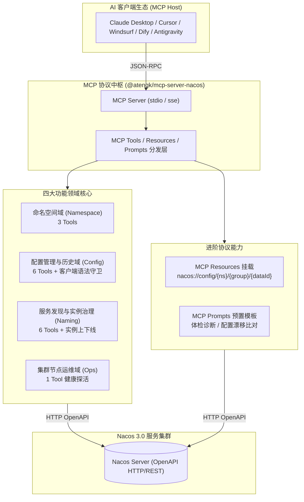

# Nacos 3.0 控制面与服务治理服务

专为各大语言模型（LLM）与智能体生态打造的生产级 **Alibaba Nacos 3.0 模型上下文协议 (Model Context Protocol, MCP)** 官方服务，基于 **TypeScript** 与 **Node.js** 现代化架构构建。

全面覆盖微服务体系中的**动态配置管理**、**配置历史审计与原子回滚**、**服务发现与实例治理**以及**集群健康诊断**，赋予 Agent 针对云原生微服务控制面的全生命周期感知与闭环调控能力。

---

## 1. 核心架构与设计特性



### 1.1 HTTP OpenAPI 协议直连
- **轻量稳定架构**：基于官方标准 HTTP OpenAPI 全面替代脆弱且难以跨环境适配的客户端 gRPC 协议，实现零专有客户端绑定的轻量级交互；
- **传输双模支持**：原生支持本地 Stdio 管道与生产级远程常驻 SSE 网络端点。

### 1.2 配置生命周期与原子回滚
- **客户端语法强守卫**：在发布与更新配置前，前置校验 JSON / YAML / XML 等格式的合法性，防止非法语法污染生产配置；
- **基于 `historyId` 原子回滚**：专用回滚工具直接基于元数据 ID 触发底层历史版本原子覆盖，彻底规避长文本反向搬运可能遭遇的上下文截断事故。

### 1.3 服务发现与精细化实例治理
- **实例动态调度**：支持针对注册实例的一键下线（下线摘流）、上线投产、权重比例平滑调节（金丝雀灰度）与元数据动态打标；
- **健康状态过滤**：支持按健康状态过滤实例，快速排查失活或亚健康节点。

### 1.4 MCP Resources 与 Prompts 深度集成
- **动态配置挂载 (Resources)**：支持形如 `nacos://config/{namespaceId}/{group}/{dataId}` 的 URI 格式，模型无需多轮触发函数即可直接查阅目标配置；
- **预置运维模板 (Prompts)**：内置 `nacos_service_inspection`（服务全景体检）与 `nacos_config_drift_check`（配置版本漂移比对与 Unified Diff 输出）。

---

## 2. 16 个核心工具契约字典 (Tools Contract)

服务精炼封装了 16 个原子工具，按微服务控制面四大技术域组织：

| 领域分类 | 工具名称 | 参数契约 | 功能描述与操作说明 |
| :--- | :--- | :--- | :--- |
| **命名空间**<br>*(Namespace)* | `nacos_list_namespaces` | `()` | 查询所有命名空间列表、命名空间 ID 与元数据 |
| | `nacos_create_namespace` | `(namespaceId, namespaceName, namespaceDesc?)` | 创建新的隔离命名空间 |
| | `nacos_delete_namespace` | `(namespaceId: string)` | 删除指定的命名空间 |
| **配置管理**<br>*(Config)* | `nacos_get_config` | `(dataId, group="DEFAULT_GROUP", tenant?, startLine?, endLine?)` | 获取指定配置项内容（支持大文本自动截断与行切片） |
| | `nacos_publish_config` | `(dataId, content, group="DEFAULT_GROUP", tenant?, type="yaml")` | 创建或更新配置（内置客户端 JSON/YAML 语法强守卫） |
| | `nacos_delete_config` | `(dataId, group="DEFAULT_GROUP", tenant?)` | 安全删除指定配置项 |
| | `nacos_list_configs` | `(dataId?, group?, tenant?, pageNo=1, pageSize=20)` | 分页与模糊检索配置清单 |
| | `nacos_get_config_history` | `(dataId, group="DEFAULT_GROUP", tenant?, pageNo=1, pageSize=10)` | 查询指定配置的历史修订版本列表（用于审查和回滚） |
| | `nacos_rollback_config` | `(dataId, historyId, group="DEFAULT_GROUP", tenant?)` | **[专用回滚]** 依据 `historyId` 原子化回滚至指定历史版本 |
| **服务发现**<br>*(Discovery)* | `nacos_list_services` | `(pageNo=1, pageSize=20, groupName?, namespaceId?)` | 分页查询微服务列表与保护阈值 |
| | `nacos_get_service` | `(serviceName, groupName?, namespaceId?)` | 获取微服务元数据与集群集群健康状态 |
| | `nacos_list_instances` | `(serviceName, groupName?, namespaceId?, healthyOnly=false)` | 查询服务下的注册实例列表，支持过滤健康节点 |
| | `nacos_register_instance` | `(serviceName, ip, port, groupName?, namespaceId?, weight=1, ephemeral=false)` | 手动向服务注册实例（默认持久化实例） |
| | `nacos_deregister_instance` | `(serviceName, ip, port, groupName?, namespaceId?, ephemeral=false)` | 从服务中安全注销指定实例 |
| | `nacos_update_instance` | `(serviceName, ip, port, enabled?, weight?, metadata?, groupName?, namespaceId?)` | 动态修改实例运行状态（上下线、权重调节与元数据） |
| **集群运维**<br>*(Ops)* | `nacos_get_server_status` | `()` | 探测 Nacos 集群节点当前运行状态与健康度 |

---

## 3. 安装与运行方式

### 3.1 方式 1：使用 `npx` 免安装直接运行（推荐）

```bash
npx -y @atengk/mcp-server-nacos
```

### 3.2 方式 2：使用 Docker 容器化运行

```bash
# 启动本地 stdio 管道
docker run -i --rm \
  -e MCP_NACOS_SERVER_URL="http://127.0.0.1:8848/nacos" \
  -e MCP_NACOS_USERNAME="nacos" \
  -e MCP_NACOS_PASSWORD="YOUR_NACOS_PASSWORD" \
  ghcr.io/atengk/mcp-server-nacos:latest
```

---

## 4. MCP 客户端配置模版

### 4.1 Claude Desktop / Cursor / Windsurf 通用配置 (Stdio 模式)

```json
{
  "mcpServers": {
    "nacos": {
      "command": "npx",
      "args": ["-y", "@atengk/mcp-server-nacos"],
      "env": {
        "MCP_NACOS_SERVER_URL": "http://127.0.0.1:8848/nacos",
        "MCP_NACOS_USERNAME": "nacos",
        "MCP_NACOS_PASSWORD": "YOUR_NACOS_PASSWORD"
      }
    }
  }
}
```

### 4.2 Dify / FastGPT 远程集成 (SSE 模式)

```json
{
  "mcpServers": {
    "nacos-remote": {
      "url": "http://192.168.1.100:3000/sse"
    }
  }
}
```

---

## 5. 环境变量与配置参数全景

| 环境变量 | 命令行参数 | 必填 | 默认值 | 作用描述 |
| :--- | :--- | :--- | :--- | :--- |
| `MCP_NACOS_SERVER_URL` | `--server-url` | 是 | 无 | Nacos 服务端地址（如 `http://127.0.0.1:8848/nacos`） |
| `MCP_NACOS_USERNAME` | `--username` | 否 | 无 | Nacos 控制台登录用户名 |
| `MCP_NACOS_PASSWORD` | `--password` | 否 | 无 | Nacos 控制台登录密码 |
| `MCP_NACOS_NAMESPACE_ID`| `--namespace-id`| 否 | 空 (public) | 缺省默认生效的命名空间 ID |
| `MCP_PORT` | `--port` | 否 | `3000` | SSE 网络模式下的 HTTP 监听端口 |
| `MCP_TRANSPORT` | `--transport` | 否 | `stdio` | 传输层模式：`stdio` 或 `sse` |

---

## 6. 相关指引

- 查看邮件通信服务：[Email 邮件服务](../tools/email.md)
- 返回服务矩阵全景：[MCP 服务矩阵总览](../index.md)
- 多客户端配置速查：[多客户端统一接入指南](../../guide/client-setup.md)
