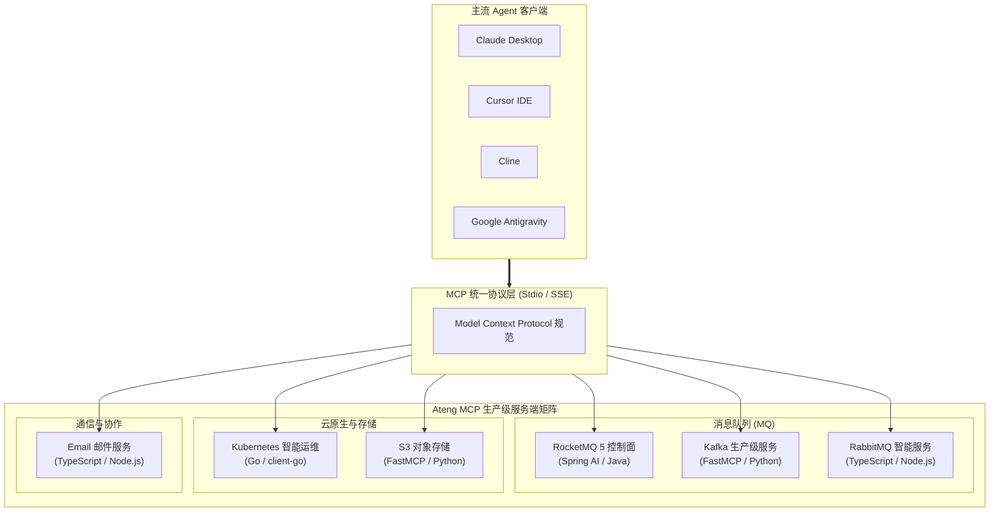

# MCP 服务矩阵总览

面向大模型与 Agent 生态的现代化 **Model Context Protocol (MCP)** 生产级服务端矩阵。通过标准化协议连接底层消息队列、云原生编排系统、对象存储与企业通信体系，赋予大语言模型对真实生产环境的安全感知与精确操作能力。

---

## 1. 矩阵服务导航

点击对应卡片即可进入具体服务端的详细设计规范、接口契约与客户端挂载指南：

<VpCardGrid :cols="3">
  <VpCard
    title="RocketMQ 5 控制面"
    desc="基于 Spring AI 的生产级消息引擎拓扑感知、Topic 与消费组治理及死信队列重投控制面。"
    icon="i-lucide-layers"
    badge="Spring AI / Java"
    badgeType="tip"
    link="./messaging/rocketmq.md"
  />
  <VpCard
    title="Kafka 生产级服务"
    desc="面向大规模事件流的 Broker 拓扑巡检、Topic 分区再均衡、消费延迟分析与消息采样回放。"
    icon="i-lucide-activity"
    badge="FastMCP / Python"
    badgeType="tip"
    link="./messaging/kafka.md"
  />
  <VpCard
    title="RabbitMQ 智能服务"
    desc="提供 Exchange 路由匹配分析、Queue 积压预警、死信投递审计与 Erlang 节点健康探测。"
    icon="i-lucide-shuffle"
    badge="TypeScript / Node"
    badgeType="info"
    link="./messaging/rabbitmq.md"
  />
  <VpCard
    title="Kubernetes 智能运维"
    desc="面向云原生集群的 SRE Copilot，支持多集群状态感知、Pod 故障根因诊断与事件流巡检。"
    icon="i-lucide-box"
    badge="Go / client-go"
    badgeType="purple"
    link="./cloud/kubernetes.md"
  />
  <VpCard
    title="S3 对象存储"
    desc="兼容 AWS S3 与 MinIO 的多云存储中枢，支持 Bucket 权限合规审计与预签名链接安全生成。"
    icon="i-lucide-hard-drive"
    badge="FastMCP / Python"
    badgeType="tip"
    link="./storage/s3.md"
  />
  <VpCard
    title="Email 邮件服务"
    desc="企业级 SMTP/IMAP 邮件自动化收发、工单告警模板渲染、收件箱重要度摘要与安全审计。"
    icon="i-lucide-mail"
    badge="TypeScript / Node"
    badgeType="info"
    link="./tools/email.md"
  />
</VpCardGrid>

---

## 2. 服务矩阵架构拓扑

---

## 3. 技术规范与协议支持对比

下表汇总了服务矩阵中全部 6 大服务端的实现栈、通信协议与运行依赖要求：

| 服务名称 | 领域分类 | 核心技术栈 | 通信协议 | 运行接入方式 | 详情文档 |
| :--- | :--- | :--- | :--- | :--- | :--- |
| **RocketMQ 5 控制面** | 消息队列 | Spring Boot 3 + Spring AI MCP | Stdio / SSE | `java -jar ...` | [查看文档](./messaging/rocketmq.md) |
| **Kafka 生产级服务** | 消息队列 | Python 3.11 + FastMCP | Stdio / SSE | `uvx ateng-kafka-mcp` | [查看文档](./messaging/kafka.md) |
| **RabbitMQ 智能服务** | 消息队列 | TypeScript + MCP SDK | Stdio / SSE | `npx ateng-rabbitmq-mcp` | [查看文档](./messaging/rabbitmq.md) |
| **Kubernetes 智能运维**| 云原生运维 | Go 1.22 + mcp-golang + client-go | Stdio / SSE | 预编译二进制 / 容器 | [查看文档](./cloud/kubernetes.md) |
| **S3 对象存储** | 存储介质 | Python 3.11 + FastMCP + boto3 | Stdio / SSE | `uvx ateng-s3-mcp` | [查看文档](./storage/s3.md) |
| **Email 邮件服务** | 通信协作 | TypeScript + Node.js + nodemailer | Stdio / SSE | `npx ateng-email-mcp` | [查看文档](./tools/email.md) |

---

## 4. 快速接入与后续指引

无论您使用哪种 Agent 客户端，均可通过标准 JSON 描述完成服务矩阵的挂载与鉴权配置：

- 客户端配置速查：[多客户端统一接入指南](../guide/client-setup.md)
- 快速入门教程：[快速起步](../guide/getting-started.md)
