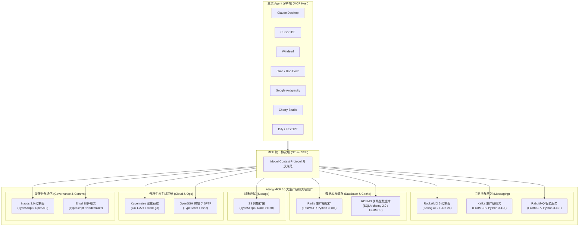

# MCP 服务矩阵总览

面向大模型与 Agent 生态的现代化 **Model Context Protocol (MCP)** 生产级服务端矩阵。通过标准化协议连接底层消息队列、数据库与缓存、云原生编排系统、主机运维终端、对象存储与微服务控制面，赋予大语言模型对真实生产环境的安全感知与精确操作能力。

---

## 1. 10 大生产级服务矩阵大盘

点击对应服务卡片即可进入具体服务端的详细架构设计、Tools 契约字典与客户端挂载指南：

<VpCardGrid :cols="3">
  <VpCard
    title="RDBMS 关系型数据库"
    desc="基于 SQLAlchemy 2.0，内置 sqlglot AST 语法树守卫，自动注入安全 LIMIT 与原子事务回滚。"
    icon="i-lucide-server"
    badge="SQLAlchemy / Python"
    badgeType="danger"
    link="/servers/database/rdbms"
  />
  <VpCard
    title="Redis 生产级缓存"
    desc="双重写门禁与高危命令物理阻断，全结构切片防 OOM 读取，智能 JSON 解析与慢查询审计。"
    icon="i-lucide-database"
    badge="FastMCP / Python"
    badgeType="danger"
    link="/servers/database/redis"
  />
  <VpCard
    title="RocketMQ 5 控制面"
    desc="基于 Spring AI 2 与 Spring Boot 4 的企业级控制面，覆盖集群拓扑、Topic/消费组治理与死信队列重投。"
    icon="i-lucide-layers"
    badge="Spring AI / Java 21"
    badgeType="tip"
    link="/servers/messaging/rocketmq"
  />
  <VpCard
    title="Kafka 生产级服务"
    desc="基于 FastMCP 与 aiokafka 异步架构，提供双重安全只读防线、零位移侵入消息采样与 Lag 堆积诊断。"
    icon="i-lucide-activity"
    badge="FastMCP / Python"
    badgeType="tip"
    link="/servers/messaging/kafka"
  />
  <VpCard
    title="RabbitMQ 智能服务"
    desc="基于 FastMCP 与异步架构，打通 AMQP 0-9-1 与 Management API，支持拓扑声明与零损采样。"
    icon="i-lucide-shuffle"
    badge="FastMCP / Python"
    badgeType="tip"
    link="/servers/messaging/rabbitmq"
  />
  <VpCard
    title="S3 对象存储"
    desc="深度兼容 RustFS、MinIO、AWS S3 与阿里云 OSS，内置三位一体安全防灾铁律与并发分段上传。"
    icon="i-lucide-hard-drive"
    badge="TypeScript / Node"
    badgeType="tip"
    link="/servers/storage/s3"
  />
  <VpCard
    title="Kubernetes 智能运维"
    desc="基于官方 client-go 构建的云原生 SRE 底座，支持 Pod 故障排障、容器日志流式读取与事件审计。"
    icon="i-lucide-box"
    badge="Go / client-go"
    badgeType="purple"
    link="/servers/cloud/kubernetes"
  />
  <VpCard
    title="OpenSSH 终端与 SFTP"
    desc="零侵入原生 OpenSSH 直连，双模命令执行与 PTY 交互伪终端，SafetyGuard 黑名单拦截与 SFTP。"
    icon="i-lucide-terminal"
    badge="TypeScript / Node"
    badgeType="purple"
    link="/servers/cloud/ssh"
  />
  <VpCard
    title="Nacos 3.0 控制面"
    desc="基于 HTTP OpenAPI，提供命名空间、配置发布与原子回滚、服务发现与实例动态调度、Prompts 体检。"
    icon="i-lucide-network"
    badge="TypeScript / Node"
    badgeType="tip"
    link="/servers/governance/nacos"
  />
  <VpCard
    title="Email 邮件服务"
    desc="支持多账户并发、RFC 会话回复保持、IMAP 复合检索、附件安全沙箱与防灾软删除的邮件能力底座。"
    icon="i-lucide-mail"
    badge="TypeScript / Node"
    badgeType="info"
    link="/servers/tools/email"
  />
</VpCardGrid>

---

## 2. 服务矩阵架构拓扑

---

## 3. 技术规范与协议支持对比

下表汇总了服务矩阵中全部 10 大服务端的实现栈、通信协议与运行接入方式：

| 服务名称 | 领域分类 | 核心技术栈 | 通信协议 | 运行接入方式 | 详情文档 |
| :--- | :--- | :--- | :--- | :--- | :--- |
| **RDBMS 关系型数据库**| 数据库/缓存 | Python 3.12+ + SQLAlchemy 2.0 + sqlglot | Stdio / SSE | `uvx atengk-mcp-server-rdbms` | [查看文档](./database/rdbms.md) |
| **Redis 生产级缓存** | 数据库/缓存 | Python 3.10+ + FastMCP + redis-py | Stdio / SSE | `uvx atengk-mcp-server-redis` | [查看文档](./database/redis.md) |
| **RocketMQ 5 控制面** | 消息队列 | Spring AI 2 + Spring Boot 4 + JDK 21 | Stdio / SSE | `npx -y @atengk/mcp-server-rocketmq` | [查看文档](./messaging/rocketmq.md) |
| **Kafka 生产级服务** | 消息队列 | Python 3.11+ + FastMCP + aiokafka | Stdio / SSE | `uvx atengk-mcp-server-kafka` | [查看文档](./messaging/kafka.md) |
| **RabbitMQ 智能服务** | 消息队列 | Python 3.11+ + FastMCP + AMQP 0-9-1 | Stdio / SSE | `uvx atengk-mcp-server-rabbitmq` | [查看文档](./messaging/rabbitmq.md) |
| **S3 对象存储** | 存储介质 | TypeScript + Node >= 20 + AWS SDK v3 | Stdio / SSE | `npx -y @atengk/mcp-server-s3` | [查看文档](./storage/s3.md) |
| **Kubernetes 智能运维**| 云原生运维 | Go 1.22+ + k8s client-go | Stdio / SSE | `npx -y @atengk/mcp-server-kubernetes` | [查看文档](./cloud/kubernetes.md) |
| **OpenSSH 终端与 SFTP**| 主机运维 | TypeScript + Node >= 18 + ssh2 | Stdio / SSE | `npx -y @atengk/mcp-server-ssh` | [查看文档](./cloud/ssh.md) |
| **Nacos 3.0 控制面** | 服务治理 | TypeScript + Node >= 20 + OpenAPI | Stdio / SSE | `npx -y @atengk/mcp-server-nacos` | [查看文档](./governance/nacos.md) |
| **Email 邮件服务** | 通信协作 | TypeScript + Node >= 20 + Nodemailer | Stdio / SSE | `npx -y @atengk/mcp-server-email` | [查看文档](./tools/email.md) |

---

## 4. 快速接入与后续指引

无论您使用哪种 Agent 客户端，均可通过标准 JSON 描述完成服务矩阵的挂载与鉴权配置：

- 客户端配置速查：[多客户端统一接入指南](../guide/client-setup.md)
- 快速入门教程：[快速起步](../guide/getting-started.md)
