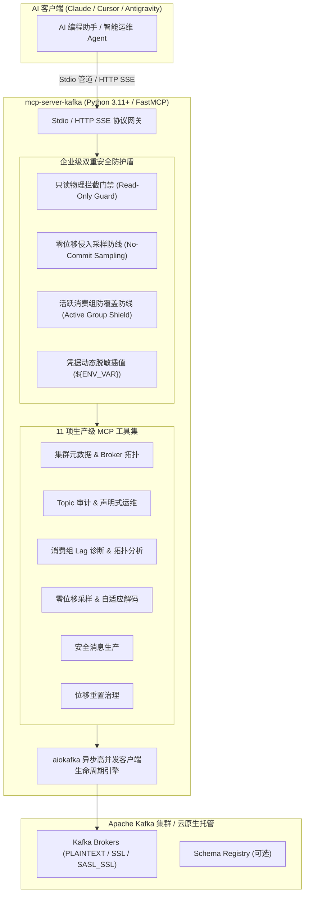

# Kafka 生产级 MCP 服务端

<div style="display: flex; gap: 8px; flex-wrap: wrap; margin: 16px 0;">
  <a href="https://github.com/atengk/mcp-server-kafka" target="_blank" rel="noopener noreferrer">
    
  </a>
  
  
  
  
  
</div>

`mcp-server-kafka` 是基于 **Python + FastMCP + aiokafka** 异步架构构建的生产级 Apache Kafka 模型上下文协议 (MCP) 服务端。它专为大模型与自主智能体（Agent）设计，内置**双重安全防线**、**零位移侵入消息采样**与 **Stdio/SSE 双模网关**，使开发者能安全、高效地让 AI 直接接入企业级 Kafka 集群。

---

## 1. 核心架构与设计亮点



### 1.1 双重安全防线机制
- **全局只读拦截 (Read-Only Guard)**：当传入 `--read-only` 或配置 `MCP_KAFKA_READ_ONLY=true` 时，在 MCP 握手层物理剔除所有写操作和变更类工具，杜绝生产事故；
- **零位移侵入采样 (Zero-Offset Sampling)**：采样消息时使用独立瞬态 Consumer 分配分区并 Seek 读取，**绝不提交任何 Offset**，彻底消除对生产消费组进度的干扰；
- **活跃消费组防并发覆盖防线**：重置位移前探测消费组成员状态，若组处于 `Stable` 且有活跃成员在线，默认强制拦截，防止因位移覆盖引发重复消费。

---

## 2. Tools 工具契约字典 (共 11 项)

| 模块分类 | 工具标识 (Tool Name) | 核心入参 (Parameters) | 职责与安全规范 |
| :--- | :--- | :--- | :--- |
| **连接与集群** | `kafka_list_connections` | *(无入参)* | 列出当前所有可用集群连接、目标地址与只读状态 |
| | `kafka_cluster_info` | `connection?` | 查询 Broker 节点拓扑、Controller 节点与集群 Controller ID |
| **主题审计** | `kafka_list_topics` | `include_internal?`, `connection?` | 列出集群业务 Topic（默认过滤 `__consumer_offsets` 等内部主题） |
| | `kafka_topic_metadata` | **`topic`**, `connection?` | 深度分析指定 Topic 的分区数、Leader、Replicas 及 ISR 同步状态 |
| | `kafka_create_topic` | **`topic`**, `num_partitions?`, `replication_factor?`, `configs?` | 声明式创建或扩容 Topic（只读模式下隐藏） |
| | `kafka_delete_topic` | **`topic`**, **`confirm: true`** | 彻底删除指定 Topic（🚨 需显式确认且只读模式下拦截） |
| **消费与积压** | `kafka_list_consumer_groups` | `state?`, `connection?` | 查询集群所有消费组清单及其协议状态 (Stable / PreparingRebalance / Empty) |
| | `kafka_consumer_group_lag` | **`group_id`**, `topic?`, `connection?` | 精确计算消费组在各分区的 Log End Offset、Current Offset 与积压总量 (Lag) |
| **采样与排障** | `kafka_sample_messages` | **`topic`**, `partition?`, `limit?` *(默认 10)*, `offset_type?`, `timestamp?` | **零位移侵入采样**：自适应解码 JSON/Text/Binary，内容 4KB 截断保护 |
| | `kafka_produce_message` | **`topic`**, **`value`**, `key?`, `partition?`, `headers?` | 发送单条测试消息至指定 Topic（只读模式下拦截） |
| | `kafka_reset_consumer_group_offsets`| **`group_id`**, **`topic`**, **`strategy`**, `timestamp?`, `force?`, **`confirm: true`** | 重置消费组位移（earliest / latest / timestamp），带活跃组防覆盖防线 |

---

## 3. 多客户端接入配置

### 3.1 Claude Desktop 配置 (`claude_desktop_config.json`)

使用 `uvx` 极速免安装拉起 Python 服务端：

```json
{
  "mcpServers": {
    "kafka": {
      "command": "uvx",
      "args": [
        "atengk-mcp-server-kafka",
        "--bootstrap-servers", "127.0.0.1:9092",
        "--read-only"
      ]
    }
  }
}
```

### 3.2 Cursor 与 Antigravity 配置

在 `.cursor/mcp.json` 或 `~/.gemini/antigravity/mcp/` 中声明：

```json
{
  "mcpServers": {
    "kafka-prod": {
      "command": "uvx",
      "args": ["atengk-mcp-server-kafka"],
      "env": {
        "MCP_KAFKA_BOOTSTRAP_SERVERS": "kafka-prod-1.internal:9092,kafka-prod-2.internal:9092",
        "MCP_KAFKA_READ_ONLY": "true"
      }
    }
  }
}
```

### 3.3 云托管与 SASL_SSL 接入 (如阿里云 / AWS MSK)

```json
{
  "mcpServers": {
    "kafka-cloud": {
      "command": "uvx",
      "args": [
        "atengk-mcp-server-kafka",
        "--bootstrap-servers", "alikafka-pre-cn.kafka.aliyuncs.com:9093",
        "--security-protocol", "SASL_SSL",
        "--sasl-mechanism", "SCRAM-SHA-256",
        "--sasl-username", "${KAFKA_SASL_USER}",
        "--sasl-password", "${KAFKA_SASL_PASSWORD}"
      ]
    }
  }
}
```

---

## 4. 环境变量与配置参数全景

| 环境变量名 | 命令行参数 | 默认值 | 说明 |
| :--- | :--- | :--- | :--- |
| `MCP_KAFKA_BOOTSTRAP_SERVERS` | `--bootstrap-servers` | `localhost:9092` | Kafka 集群接入 Broker 地址列表 |
| `MCP_KAFKA_READ_ONLY` | `--read-only` | `false` | 全局只读门禁开关，开启后禁用写/删工具 |
| `MCP_KAFKA_SECURITY_PROTOCOL` | `--security-protocol` | `PLAINTEXT` | 安全通信协议 (`PLAINTEXT` / `SSL` / `SASL_PLAINTEXT` / `SASL_SSL`) |
| `MCP_KAFKA_SASL_MECHANISM` | `--sasl-mechanism` | 无 | SASL 认证机制 (`PLAIN` / `SCRAM-SHA-256` / `SCRAM-SHA-512`) |
| `MCP_KAFKA_SASL_USERNAME` | `--sasl-username` | 无 | SASL 鉴权用户名 |
| `MCP_KAFKA_SASL_PASSWORD` | `--sasl-password` | 无 | SASL 鉴权密码（支持 `${ENV}` 表达式） |
| `MCP_KAFKA_CONFIG` | `--config` | 无 | 外部多集群多连接 YAML 配置文件路径 |
| `MCP_KAFKA_TRANSPORT` | `--transport` | `stdio` | 协议传输模式 (`stdio` 或 `sse`) |
| `MCP_KAFKA_PORT` | `--port` | `8000` | HTTP SSE 模式下的监听端口 |

---

## 5. 本地运行与 Docker 快速启动

```bash
# 1. 终端通过 uvx 零安装启动
uvx atengk-mcp-server-kafka --bootstrap-servers localhost:9092 --read-only

# 2. Docker 常驻运行 HTTP SSE 网关
docker run -d \
  --name mcp-server-kafka \
  -p 8000:8000 \
  -e MCP_KAFKA_BOOTSTRAP_SERVERS=host.docker.internal:9092 \
  -e MCP_KAFKA_READ_ONLY=true \
  ghcr.io/atengk/mcp-server-kafka:latest
```

---

## 6. 相关资源与互链

- 官方开源仓库：[atengk/mcp-server-kafka](https://github.com/atengk/mcp-server-kafka)
- 返回服务矩阵总览：[MCP 服务矩阵总览](../index.md)
- 客户端配置参考：[多客户端统一接入指南](../../guide/client-setup.md)
