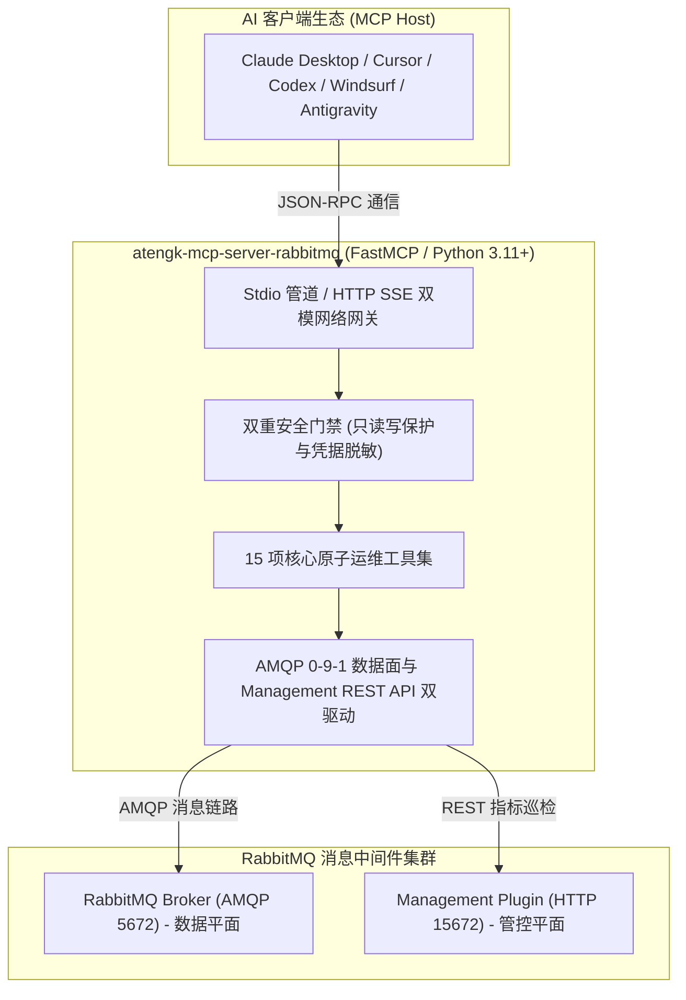

# RabbitMQ 智能 MCP 服务端

<div style="display: flex; gap: 8px; flex-wrap: wrap; margin: 16px 0;">
  <a href="https://github.com/atengk/mcp-server-rabbitmq" target="_blank" rel="noopener noreferrer">
    
  </a>
  
  
  
  
  
</div>

`atengk-mcp-server-rabbitmq` 是专为大语言模型（LLM）与智能体打造的生产级 **RabbitMQ Model Context Protocol (MCP)** 服务端，基于 **Python 3.11+** 与 **FastMCP** 异步现代化架构构建。

服务深度打通 **AMQP 0-9-1 二进制数据协议** 与 **RabbitMQ HTTP Management API 管控平台**，向 AI 助手暴露完整的拓扑声明、消息发布、零损诊断采样、队列积压治理与微服务信道排障能力。

---

## 1. 核心架构与双驱机制



### 1.1 数据面与管控面清晰解耦
- **数据平面 (Data Plane - AMQP 5672)**：负责核心消息发布、零损窥探采样、队列声明与绑定。纯二进制高性能流协议保障吞吐；
- **管控平面 (Control Plane - HTTP 15672)**：负责集群全局概览、微服务物理连接监控、活跃信道堆积诊断，由 Management 插件提供；
- **优雅降级防御**：若未配置 Management API，全套 AMQP 消息收发与拓扑功能完全不受影响；调用排障诊断工具时自动返回清晰降级提示，绝不异常崩溃。

### 1.2 生产级安全防护体系
- **强只读写保护门禁**：未显式开启 `--allow-write` 时，任何破坏性变更（声明拓扑、清空队列、物理出队 ACK、发布消息）一律被即时阻断；
- **高危指令二次确认机制**：清空与删除队列强制要求传入 `confirm=True`，未传时仅返回受影响资源预估报告，绝不发生物理执行；
- **零损采样 (Zero-Loss Peek)**：采样读取后在退出阶段统一延迟批量执行 `reject(requeue=True)`，保证队列消息数量与顺序完全零破坏；
- **全域凭据脱敏算法**：任何连接串、字典属性或错误堆栈中的密码与认证 Token 统一替换为 `***`，彻底阻断大模型会话凭证泄露。

---

## 2. 15 个核心工具契约字典 (Tools Contract)

### 2.1 集群拓扑与集群全景概览 (4 项)
| 工具名称 | 功能描述 | 门禁约束 |
| :--- | :--- | :--- |
| `rabbitmq_overview` | 检查 RabbitMQ 节点健康度、Erlang 版本、连接数与全集群消息吞吐率 | 只读 |
| `rabbitmq_list_nodes` | 获取集群所有节点的运行明细、内存与磁盘报警状态 | 只读 |
| `rabbitmq_list_vhosts` | 查询所有虚拟主机清单及关联追踪参数 | 只读 |
| `rabbitmq_list_exchanges` | 查询所有 Exchange 交换机类型（direct/fanout/topic/headers）与属性 | 只读 |

### 2.2 队列深度指标与拓扑声明 (6 项)
| 工具名称 | 功能描述 | 门禁约束 |
| :--- | :--- | :--- |
| `rabbitmq_list_queues` | 查询各队列就绪数、未确认数与消费者数 | 只读 |
| `rabbitmq_get_queue` | 获取单个队列深度指标（死信交换机、TTL、最大积压限制等） | 只读 |
| `rabbitmq_declare_queue` | 声明队列，支持死信路由 (`dlx`) 与最大积压策略 (`x-max-length`) | 需 `--allow-write` |
| `rabbitmq_purge_queue` | 清空指定队列中积压的消息 | 需 `--allow-write` 且 `confirm=True` |
| `rabbitmq_delete_queue` | 删除指定队列 | 需 `--allow-write` 且 `confirm=True` |
| `rabbitmq_list_bindings` | 查询交换机与队列之间的 Routing Key 绑定关系规则 | 只读 |
| `rabbitmq_bind_queue` | 将队列绑定到目标交换机 | 需 `--allow-write` |
| `rabbitmq_unbind_queue` | 解除队列与交换机之间的绑定关系 | 需 `--allow-write` |

### 2.3 消息发布、零损采样与受控拉取 (3 项)
| 工具名称 | 功能描述 | 门禁约束 |
| :--- | :--- | :--- |
| `rabbitmq_publish_message` | 向指定 Exchange/Routing Key 发布消息，支持字典自动序列化与自定义属性 | 需 `--allow-write` |
| `rabbitmq_peek_messages` | 对队列头部实施**无损诊断采样**，自动批量 Requeue 归还队首，消息零丢失不出队 | 只读 |
| `rabbitmq_get_messages` | 受控拉取消费消息，默认 `ack=False` 仅拉取，传 `ack=True` 物理确认出队 | `ack=True` 需 `--allow-write` |

### 2.4 客户端连接与活跃信道排障诊断 (2 项)
| 工具名称 | 功能描述 | 门禁约束 |
| :--- | :--- | :--- |
| `rabbitmq_list_client_connections` | 排查外部微服务客户端连入 RabbitMQ 的物理 TCP 链路、信道数与收发吞吐速率 | 只读 |
| `rabbitmq_list_channels` | 诊断活跃信道未确认消息积压 (`unack`)、QoS Prefetch 限额与消费速率 | 只读 |

---

## 3. 安装与运行方式

推荐使用现代化 Python 工具 [`uv`](https://docs.astral.sh/uv/) / `uvx` 秒级拉起运行：

```bash
# 1. 默认只读模式直连本地 RabbitMQ 实例
uvx atengk-mcp-server-rabbitmq --rmq-host localhost --rmq-port 5672

# 2. 携带完整凭据与 Management API 端口
uvx atengk-mcp-server-rabbitmq \
  --rmq-host 127.0.0.1 \
  --rmq-port 5672 \
  -u guest \
  -P YOUR_PASSWORD \
  --management-port 15672

# 3. 开启写入权限 (允许拓扑声明与发布)
uvx atengk-mcp-server-rabbitmq --rmq-host localhost --allow-write
```

---

## 4. MCP 客户端配置模版

### 4.1 Claude Desktop / Cursor / Windsurf 通用配置 (Stdio 模式)

```json
{
  "mcpServers": {
    "rabbitmq": {
      "command": "uvx",
      "args": [
        "atengk-mcp-server-rabbitmq",
        "--rmq-host", "127.0.0.1",
        "--rmq-port", "5672",
        "-u", "guest",
        "-P", "YOUR_RABBITMQ_PASSWORD",
        "--management-port", "15672"
      ]
    }
  }
}
```

### 4.2 环境变量分立注入模式 (推荐，特殊字符免转义)

```json
{
  "mcpServers": {
    "rabbitmq-env": {
      "command": "uvx",
      "args": ["atengk-mcp-server-rabbitmq"],
      "env": {
        "MCP_RABBITMQ_HOST": "127.0.0.1",
        "MCP_RABBITMQ_PORT": "5672",
        "MCP_RABBITMQ_USERNAME": "guest",
        "MCP_RABBITMQ_PASSWORD": "YOUR_RABBITMQ_PASSWORD",
        "MCP_RABBITMQ_VHOST": "/",
        "MCP_RABBITMQ_MANAGEMENT_PORT": "15672",
        "MCP_RABBITMQ_ALLOW_WRITE": "false"
      }
    }
  }
}
```

### 4.3 OpenAI Codex 配置 (`~/.codex/config.toml`)

```toml
[mcp_servers.rabbitmq]
command = "uvx"
args = [
  "atengk-mcp-server-rabbitmq",
  "--rmq-host", "127.0.0.1",
  "--rmq-port", "5672",
  "-u", "guest",
  "-P", "YOUR_RABBITMQ_PASSWORD"
]
```

---

## 5. 命令行参数与环境变量全景速查

| CLI 参数 | 对应环境变量 | 默认值 | 参数说明 |
| :--- | :--- | :--- | :--- |
| `--broker-host`, `--rmq-host` | `MCP_RABBITMQ_HOST` | `localhost` | RabbitMQ Broker 主机名或 IP 地址 |
| `--broker-port`, `--rmq-port` | `MCP_RABBITMQ_PORT` | `5672` | RabbitMQ Broker AMQP 端口（开启 SSL 时为 5671） |
| `-u`, `--username`, `--user` | `MCP_RABBITMQ_USERNAME` | `guest` | RabbitMQ 连接认证用户名 |
| `-P`, `--password` | `MCP_RABBITMQ_PASSWORD` | `guest` | RabbitMQ 连接认证密码（日志强制脱敏） |
| `--vhost` | `MCP_RABBITMQ_VHOST` | `/` | 目标虚拟主机名称 |
| `--ssl` | `MCP_RABBITMQ_SSL` | `False` | 是否开启 AMQP SSL/TLS 加密通信 (`amqps://`) |
| `--management-host` | `MCP_RABBITMQ_MANAGEMENT_HOST` | 继承 Broker 主机 | Management HTTP API 服务主机名 |
| `--management-port` | `MCP_RABBITMQ_MANAGEMENT_PORT` | `15672` | Management HTTP API 服务端口号 |
| `--allow-write` | `MCP_RABBITMQ_ALLOW_WRITE` | `False` | 开启写保护门禁放行标志 |
| `-t, --transport` | `MCP_RABBITMQ_TRANSPORT` | `stdio` | MCP 传输层协议：`stdio` 或 `sse` |

---

## 6. 相关指引

- 查看其他消息队列：[RocketMQ 5 控制面](./rocketmq.md) | [Kafka 生产级服务](./kafka.md)
- 返回服务矩阵全景：[MCP 服务矩阵总览](../index.md)
- 多客户端配置速查：[多客户端统一接入指南](../../guide/client-setup.md)
