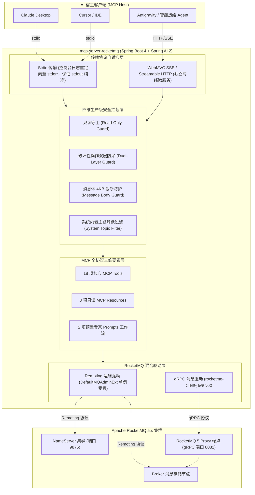

# RocketMQ 5 智能化控制面 MCP 服务

<div style="display: flex; gap: 8px; flex-wrap: wrap; margin: 16px 0;">
  <a href="https://github.com/atengk/mcp-server-rocketmq" target="_blank" rel="noopener noreferrer">
    
  </a>
  
  
  
  
  
  
</div>

`mcp-server-rocketmq` 是专为 **Apache RocketMQ 5** 打造的企业级智能化连接服务，遵循开放标准 [Model Context Protocol (MCP)](https://modelcontextprotocol.io/) 规范设计，基于 **Spring AI 2 + Spring Boot 4 + JDK 21** 现代云原生技术栈构建，全面支持 GraalVM 原生二进制与 npx 免安装秒开。

它将大语言模型智能体（Claude Desktop、Cursor、Antigravity 等各类 AI 编程助手与智能运维 Agent）与分布式消息中间件 Apache RocketMQ 5 深度打通。通过暴露标准化的 MCP **Tools（工具）**、**Resources（只读资源）** 与 **Prompts（专家排障工作流）**，赋能智能体通过自然语言直接探查集群健康、秒级定位消费堆积、全链路检索消息、排查死信根因，并安全受控地执行消息收发与位点治理。

---

## 1. 系统架构与双模拓扑

本项目采用 **Remoting 深度运维管理 + gRPC 云原生消息收发** 的混合双驱动架构，深度兼顾底层集群运维探测与高吞吐消息收发：



---

## 2. 四维生产级安全防护门禁

在连接生产集群时，系统内置了严格的安全铁律，防止大模型发生幻觉或越权误操作：

1. **只读守卫 (Read-Only Guard)**：当配置 `ROCKETMQ_READ_ONLY=true` 时，在握手层物理隐藏所有写操作与破坏性工具，仅暴露指标巡检与消息查询能力。
2. **双层防呆确认 (Dual-Layer Guard)**：删除主题、重置消费位点、死信重新投递等破坏性高危动作，不仅需要配置开启 `ROCKETMQ_ALLOW_DESTRUCTIVE=true`，还必须由模型在调用时显式传入 `confirm: true`，否则拒绝执行。
3. **4KB 消息截断防护 (Message Body Guard)**：大消息体内容直读时强制实施 4KB 上限截断并注入警告标识，彻底消除上下文爆炸与 Token 耗尽风险。
4. **系统内置主题静默过滤 (System Topic Filter)**：枚举主题时自动静默过滤 `RMQ_SYS_*` 等系统内部主题，避免污染模型视觉或被误触。

---

## 3. MCP Tools 工具契约字典 (共 18 项)

服务完整暴露了 18 项标准化原子工具，涵盖集群、主题、消费组、消息与死信全生命周期：

| 领域模块 | 工具标识 (Tool Name) | 核心入参 (Parameters) | 职责说明 | 安全防护级别 |
| :--- | :--- | :--- | :--- | :--- |
| **集群拓扑域** | `rocketmq_cluster_info` | *(无入参)* | 查询 NameServer / Broker 节点分布、角色与在线状态 | 只读查询 |
| | `rocketmq_broker_stats` | **`brokerAddr`** | 查询指定 Broker 运行时核心指标（吞吐量、写入 TPS、物理磁盘水位） | 只读查询 |
| **主题生命周期** | `rocketmq_list_topics` | `includeSystem?` | 列出集群业务 Topic（默认过滤系统内部管理主题） | 只读查询 |
| | `rocketmq_topic_route` | **`topic`** | 查询指定 Topic 的读写队列分布与 Broker 路由详情 | 只读查询 |
| | `rocketmq_topic_status` | **`topic`** | 查询指定 Topic 各分片队列的最小/最大 Offset 与堆积容量统计 | 只读查询 |
| | `rocketmq_create_topic` | **`topic`**, `readQueueNums?`, `writeQueueNums?`, `perm?` | 声明式创建或更新指定 Topic（动态配置队列数与读写权限） | 受 `read-only` 约束 |
| | `rocketmq_delete_topic` | **`topic`**, **`confirm: true`** | 彻底清理下线指定业务 Topic | 🚨 **双层防呆保护** |
| **消费组与积压** | `rocketmq_list_consumer_groups` | `includeSystem?` | 获取所有已注册的消费组清单 | 只读查询 |
| | `rocketmq_consumer_status` | **`consumerGroup`** | 查询消费组的在线客户端 ID、IP 端口及订阅详情 | 只读查询 |
| | `rocketmq_consumer_lag` | **`consumerGroup`**, `topic?` | 精确计算消费组在各分片队列的未消费堆积量 (Lag) | 只读查询 |
| | `rocketmq_top_consumer_lag` | `topN?` *(默认 10)* | **全集群积压排行榜**：极速检出堆积最严重的 TopN 消费组 | 只读查询 |
| | `rocketmq_reset_consumer_offset`| **`consumerGroup`**, **`topic`**, **`resetType`**, `timestamp?`, **`confirm: true`** | 按时间戳回溯或按最大位点跳过重置消费点位 | 🚨 **双层防呆保护** |
| **消息检索排查** | `rocketmq_query_message_by_id` | **`topic`**, **`msgId`** | 根据 32 位 Message ID 精确检索消息内容与用户属性 | 只读 (4KB 截断) |
| | `rocketmq_query_message_by_key`| **`topic`**, **`key`**, `beginTimestamp?`, `endTimestamp?`, `maxNum?` | 根据业务 Key 在指定时间窗口内扫描匹配的消息列表 | 只读 (4KB 截断) |
| | `rocketmq_query_dlq_messages` | **`consumerGroup`**, `maxNum?` | 检索指定消费组死信队列（DLQ）中的失败堆积消息 | 只读 (4KB 截断) |
| | `rocketmq_query_message_trace` | **`msgId`**, `topic?` | 调阅单条消息自 Producer、Broker 至 Consumer 的全链路轨迹耗时 | 只读 (4KB 截断) |
| **消息生产自愈** | `rocketmq_send_message` | **`topic`**, **`body`**, `tag?`, `keys?`, `messageGroup?`, `deliveryTimestamp?` | 发送测试消息（支持普通、分区顺序与定时延时消息） | 受 `read-only` 约束 |
| | `rocketmq_resend_dlq_message` | **`consumerGroup`**, **`msgId`**, **`targetTopic`**, **`confirm: true`** | 将死信队列中的指定消息重新投递回业务 Topic 触发重试 | 🚨 **双层防呆保护** |

> 📌 **注**：加粗表示必填项，带 `?` 表示可选参数。

---

## 4. MCP Resources 与 Prompts 扩展

### 4.1 MCP Resources (只读上下文)

- **`rocketmq://cluster/topology`**：集群物理拓扑快照（Broker 角色、地址与运行时版本）。
- **`rocketmq://topics`**：当前集群所有业务主题清单与队列分布概览。
- **`rocketmq://server/status`**：服务端自身运行时配置（只读状态、高危开关与限制参数）。

### 4.2 MCP Prompts (专家预置工作流)

- **`diagnose-consumer-lag`**：一键触发消费积压全自动根因排查（识别慢消费节点、拉取 TPS 波动、计算堆积预计耗时）。
- **`investigate-dlq-root-cause`**：死信队列消息深度分析（解码异常堆栈、比对投递时间、提供修复建议）。

---

## 5. 主流客户端接入配置

### 5.1 Claude Desktop 配置 (`claude_desktop_config.json`)

通过 npm 官方分发包 `@atengk/mcp-server-rocketmq` 零安装秒开：

```json
{
  "mcpServers": {
    "rocketmq": {
      "command": "npx",
      "args": ["-y", "@atengk/mcp-server-rocketmq"],
      "env": {
        "ROCKETMQ_NAMESRV_ADDR": "127.0.0.1:9876",
        "ROCKETMQ_READ_ONLY": "false",
        "ROCKETMQ_ALLOW_DESTRUCTIVE": "false"
      }
    }
  }
}
```

### 5.2 Cursor 与 Antigravity 配置

在 `.cursor/mcp.json` 或 `~/.gemini/antigravity/mcp/` 中声明：

```json
{
  "mcpServers": {
    "rocketmq-prod": {
      "command": "npx",
      "args": ["-y", "@atengk/mcp-server-rocketmq"],
      "env": {
        "ROCKETMQ_NAMESRV_ADDR": "namesrv.internal:9876",
        "ROCKETMQ_PROXY_ADDR": "proxy.internal:8081",
        "ROCKETMQ_ACCESS_KEY": "${ROCKETMQ_AK}",
        "ROCKETMQ_SECRET_KEY": "${ROCKETMQ_SK}",
        "ROCKETMQ_READ_ONLY": "true"
      }
    }
  }
}
```

### 5.3 GraalVM 原生二进制或 Java Jar

若需要在未安装 Node.js 的独立生产环境运行预编译原生二进制或 Jar：

```json
{
  "mcpServers": {
    "rocketmq": {
      "command": "/opt/mcp/rocketmq-mcp-server",
      "env": {
        "ROCKETMQ_NAMESRV_ADDR": "namesrv.internal:9876",
        "ROCKETMQ_PROXY_ADDR": "proxy.internal:8081",
        "ROCKETMQ_ACCESS_KEY": "${ROCKETMQ_AK}",
        "ROCKETMQ_SECRET_KEY": "${ROCKETMQ_SK}"
      }
    }
  }
}
```

### 5.4 HTTP SSE 远程长连接模式

适合部署在云原生 Kubernetes 集群或集中运维网关中：

```json
{
  "mcpServers": {
    "rocketmq-remote": {
      "url": "http://rocketmq-mcp.infra.internal:8080/sse"
    }
  }
}
```

---

## 6. 环境变量配置全景

| 环境变量名 | 默认值 | 作用与规范说明 |
| :--- | :--- | :--- |
| `ROCKETMQ_NAMESRV_ADDR` | `127.0.0.1:9876` | RocketMQ NameServer 集群地址，多个地址以分号分隔 |
| `ROCKETMQ_PROXY_ADDR` | 无 | RocketMQ 5.x gRPC Proxy 地址（发信与死信重投需要） |
| `ROCKETMQ_ACCESS_KEY` | 无 | ACL 访问控制鉴权 AccessKey（可选） |
| `ROCKETMQ_SECRET_KEY` | 无 | ACL 访问控制鉴权 SecretKey（可选） |
| `ROCKETMQ_READ_ONLY` | `false` | 全局只读安全防线开关，开启后物理隐藏所有写/删工具 |
| `ROCKETMQ_ALLOW_DESTRUCTIVE` | `false` | 是否允许执行删除主题与重置位点等高危操作 |
| `ROCKETMQ_MAX_MESSAGE_BYTES`| `4096` | 消息直读内容截断上限（字节） |
| `SERVER_PORT` | `8080` | SSE 远程服务模式下的 HTTP 监听端口 |

---

## 7. 本地运行与 Docker 快速启动

```bash
# 1. 本地通过 npx 快速启动测试
npx -y @atengk/mcp-server-rocketmq --namesrv 127.0.0.1:9876

# 2. Docker 单命令启动常驻 SSE 服务
docker run -d \
  --name mcp-server-rocketmq \
  -p 8080:8080 \
  -e ROCKETMQ_NAMESRV_ADDR=host.docker.internal:9876 \
  -e ROCKETMQ_READ_ONLY=true \
  ghcr.io/atengk/mcp-server-rocketmq:latest
```

---

## 8. 相关资源与互链

- 官方开源仓库：[atengk/mcp-server-rocketmq](https://github.com/atengk/mcp-server-rocketmq)
- 返回服务矩阵总览：[MCP 服务矩阵总览](../index.md)
- 客户端配置参考：[多客户端统一接入指南](../../guide/client-setup.md)
