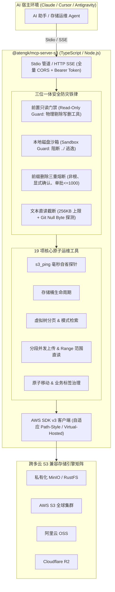

# S3 生产级对象存储 MCP 服务端

<div style="display: flex; gap: 8px; flex-wrap: wrap; margin: 16px 0;">
  <a href="https://github.com/atengk/mcp-server-s3" target="_blank" rel="noopener noreferrer">
    
  </a>
  
  
  
  
  
</div>

`@atengk/mcp-server-s3` 是基于标准 **S3 协议** 深度连接与管控各大主流兼容对象存储（**RustFS、MinIO、AWS S3、阿里云 OSS、Cloudflare R2、腾讯云 COS** 等）的生产级 Model Context Protocol (MCP) 服务端。为大语言模型与自主智能体（Claude Desktop、Cursor、Antigravity、Cline 等）提供安全、可控、高内聚的对象存储全生命周期管理与数据流动基础设施。

---

## 1. 核心架构与三位一体防灾铁律



### 核心安全防线说明
1. **只读门禁 (`MCP_S3_READ_ONLY=true`)**：在握手层物理隐藏所有破坏性写/删类工具；
2. **工作区沙箱隔离 (`MCP_S3_ALLOWED_LOCAL_DIR`)**：严格限定上传下载的本地文件读写边界，彻底阻断路径遍历（`../`）攻击；
3. **前缀递归删除三重熔断**：强制拦截根前缀、强制要求显式 `confirm_recursive_delete: true`、单批次严格限制 1000 上限；
4. **大文件并发分段上传**：对超过 32MB 的本地大文件自动开启 8MB 分片并发分段上传，突破 5GB 单流上限并极大增强抗重试韧性。

---

## 2. Tools 工具契约字典 (共 19 项)

| 模块分类 | 工具标识 (Tool Name) | 核心入参 (Parameters) | 职责与安全规范 |
| :--- | :--- | :--- | :--- |
| **探针与桶管理** | `s3_ping` | *(无入参)* | 毫秒级自检端点连通性、网络 RTT、生效 Region 与脱敏鉴权身份 |
| | `list_buckets` | *(无入参)* | 列出所有存储桶名称及创建时间列表 |
| | `create_bucket` | **`bucket`**, `region?` | 声明式创建新存储桶 |
| | `delete_bucket` | **`bucket`**, `force?` | 删除存储桶（只读门禁下隐藏，支持 force 强制清空后删桶） |
| | `get_bucket_location` | **`bucket`** | 查询存储桶的物理实际部署地域 |
| **检索与内容直读** | `list_objects` | `bucket?`, `prefix?`, `delimiter?`, `max_keys?`, `continuation_token?` | 模拟分层虚拟目录树（Delimiter 默认为 `/`），支持游标分页 |
| | `search_objects` | `query`, `bucket?`, `prefix?`, `max_results?` | 在前缀路径树中执行关键字匹配与模式搜索 |
| | `stat_object` | **`key`**, `bucket?` | 提取对象大小、Content-Type、最后修改时间、ETag 及元数据 |
| | `read_object_text` | **`key`**, `bucket?`, `max_bytes?`, `encoding?` | 纯文本直读，256KB 阈值截断保护；**支持仿 Git Null Byte 探测** |
| | `read_object_range` | **`key`**, **`start_byte`**, **`end_byte`**, `bucket?` | HTTP Range 字节范围读取（适用于大日志尾部排障） |
| **流式互传与直链** | `put_object_text` | **`key`**, **`content`**, `bucket?`, `content_type?` | 文本/JSON 内容直传与对象覆盖 |
| | `upload_file` | **`key`**, **`local_path`**, `bucket?`, `content_type?` | 本地文件流式上传，受沙箱保护；**>32MB 自动启用并发分段上传** |
| | `download_file` | **`key`**, **`local_path`**, `bucket?` | S3 对象流式保存为本地文件，受工作区沙箱保护 |
| | `get_presigned_url`| **`key`**, `bucket?`, `expires_in?`, `method?` | 为大文件或多媒体生成有时效的预签名 HTTP 直链（GET/PUT） |
| **批处理与治理** | `copy_object` | **`source_key`**, **`target_key`**, `source_bucket?`, `target_bucket?` | 同桶与跨桶对象复制 |
| | `move_object` | **`source_key`**, **`target_key`**, `source_bucket?`, `target_bucket?` | 原子化移动与重命名（复制成功后安全删除源对象） |
| | `delete_object` | **`key`**, `bucket?` | 删除指定的单个对象 |
| | `delete_objects_batch`| **`keys`**, `bucket?` | 批量删除指定的多个对象键列表（单批上限 1000） |
| | `delete_objects_by_prefix`| **`prefix`**, **`confirm_recursive_delete: true`**, `bucket?` | 递归清理虚拟子目录，内置三重防灾熔断守卫 |
| | `get_object_tags` | **`key`**, `bucket?` | 查询对象关联的 Key-Value 标签字典 |
| | `set_object_tags` | **`key`**, **`tags`**, `bucket?` | 写入或全量覆盖对象业务标签 |

---

## 3. 多云兼容存储配置范例

### 3.1 MinIO / 私有化 RustFS (Path-Style 模式)

```json
{
  "mcpServers": {
    "s3-minio": {
      "command": "npx",
      "args": ["-y", "@atengk/mcp-server-s3"],
      "env": {
        "MCP_S3_ENDPOINT": "http://127.0.0.1:9000",
        "MCP_S3_REGION": "us-east-1",
        "MCP_S3_ACCESS_KEY_ID": "${MINIO_ACCESS_KEY}",
        "MCP_S3_SECRET_ACCESS_KEY": "${MINIO_SECRET_KEY}",
        "MCP_S3_FORCE_PATH_STYLE": "true",
        "MCP_S3_DEFAULT_BUCKET": "dev-bucket"
      }
    }
  }
}
```

### 3.2 阿里云 OSS 接入配置

```json
{
  "mcpServers": {
    "s3-aliyun-oss": {
      "command": "npx",
      "args": ["-y", "@atengk/mcp-server-s3"],
      "env": {
        "MCP_S3_ENDPOINT": "https://oss-cn-hangzhou.aliyuncs.com",
        "MCP_S3_REGION": "oss-cn-hangzhou",
        "MCP_S3_ACCESS_KEY_ID": "${ALIBABA_CLOUD_ACCESS_KEY_ID}",
        "MCP_S3_SECRET_ACCESS_KEY": "${ALIBABA_CLOUD_ACCESS_KEY_SECRET}",
        "MCP_S3_FORCE_PATH_STYLE": "false",
        "MCP_S3_DEFAULT_BUCKET": "company-oss-bucket"
      }
    }
  }
}
```

### 3.3 AWS S3 生产安全只读配置

```json
{
  "mcpServers": {
    "s3-aws-prod": {
      "command": "npx",
      "args": ["-y", "@atengk/mcp-server-s3"],
      "env": {
        "MCP_S3_REGION": "us-west-2",
        "MCP_S3_ACCESS_KEY_ID": "${AWS_ACCESS_KEY_ID}",
        "MCP_S3_SECRET_ACCESS_KEY": "${AWS_SECRET_ACCESS_KEY}",
        "MCP_S3_READ_ONLY": "true",
        "MCP_S3_DEFAULT_BUCKET": "company-prod-logs"
      }
    }
  }
}
```

### 3.4 Cloudflare R2 接入配置

```json
{
  "mcpServers": {
    "s3-r2": {
      "command": "npx",
      "args": ["-y", "@atengk/mcp-server-s3"],
      "env": {
        "MCP_S3_ENDPOINT": "https://<ACCOUNT_ID>.r2.cloudflarestorage.com",
        "MCP_S3_REGION": "auto",
        "MCP_S3_ACCESS_KEY_ID": "${R2_ACCESS_KEY_ID}",
        "MCP_S3_SECRET_ACCESS_KEY": "${R2_SECRET_ACCESS_KEY}",
        "MCP_S3_DEFAULT_BUCKET": "my-r2-bucket"
      }
    }
  }
}
```

---

## 4. 主流客户端接入映射 (Claude Desktop / Cursor / Antigravity)

所有支持 MCP 的客户端均遵循一致的声明结构，仅配置文件所在位置不同：

- **Claude Desktop**：写入 `%APPDATA%\Claude\claude_desktop_config.json` (Windows) 或 `~/Library/Application Support/Claude/claude_desktop_config.json` (macOS)；
- **Cursor IDE**：在工程根目录创建 `.cursor/mcp.json`；
- **Google Antigravity**：在工作区配置或系统配置目录 `~/.gemini/antigravity/` 下挂载；
- **SSE 远程模式（全客户端通用）**：若服务端以常驻 HTTP 容器化启动，客户端仅需声明 `"url": "http://s3-mcp.internal:8000/sse"`。

---

## 5. 环境变量矩阵全景

| 规范主环境变量 (`MCP_S3_*`) | 兼容备用变量 (`AWS_*`) | 默认值 | 说明 |
| :--- | :--- | :--- | :--- |
| `MCP_S3_ENDPOINT` | `AWS_ENDPOINT_URL_S3` | 无 | S3 兼容接入端点（如 `http://127.0.0.1:9000`） |
| `MCP_S3_REGION` | `AWS_REGION` | `us-east-1` | 目标物理地域 |
| `MCP_S3_ACCESS_KEY_ID` | `AWS_ACCESS_KEY_ID` | 无 | S3 访问密钥 ID |
| `MCP_S3_SECRET_ACCESS_KEY`| `AWS_SECRET_ACCESS_KEY` | 无 | S3 访问密钥 Secret |
| `MCP_S3_FORCE_PATH_STYLE` | 无 | `false` | 是否强制 Path-Style 路径寻址（MinIO/RustFS 需设为 `true`） |
| `MCP_S3_DEFAULT_BUCKET` | 无 | 无 | 缺省存储桶名称（未传参时自动回退） |
| `MCP_S3_READ_ONLY` | 无 | `false` | 全局只读安全门禁开关 |
| `MCP_S3_ALLOWED_LOCAL_DIR`| 无 | 无 | 本地文件上传/下载沙箱受管目录（严格防路径穿越） |

---

## 6. 本地运行与 Docker 快速启动

```bash
# 1. 终端命令行即时测试
npx -y @atengk/mcp-server-s3 --endpoint http://127.0.0.1:9000 --path-style --read-only

# 2. Docker 镜像运行常驻 HTTP SSE 守护网关
docker run -d \
  --name mcp-server-s3 \
  -p 8000:8000 \
  -e MCP_S3_ENDPOINT=http://host.docker.internal:9000 \
  -e MCP_S3_FORCE_PATH_STYLE=true \
  -e MCP_S3_READ_ONLY=true \
  ghcr.io/atengk/mcp-server-s3:latest
```

---

## 7. 相关资源与互链

- 官方开源仓库：[atengk/mcp-server-s3](https://github.com/atengk/mcp-server-s3)
- 返回服务矩阵总览：[MCP 服务矩阵总览](../index.md)
- 客户端配置参考：[多客户端统一接入指南](../../guide/client-setup.md)
