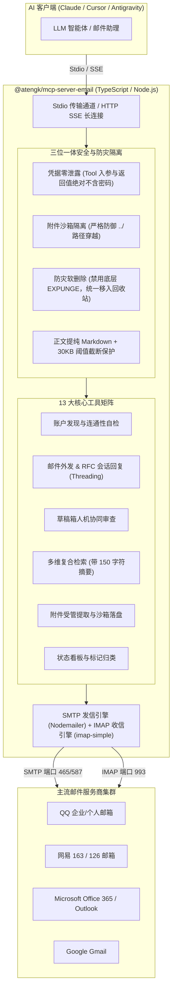

# Email 智能化 MCP 服务端

<div style="display: flex; gap: 8px; flex-wrap: wrap; margin: 16px 0;">
  <a href="https://github.com/atengk/mcp-server-email" target="_blank" rel="noopener noreferrer">
    
  </a>
  
  
  
  
  
</div>

`@atengk/mcp-server-email` 是专为大语言模型（LLM）与自主智能体（Agent）打造的生产级邮件能力底座。通过遵循标准化 [Model Context Protocol (MCP)](https://modelcontextprotocol.io/) 协议，为各类客户端宿主提供完整的电子邮件外发、会话回复、草稿审查、多维检索、正文提纯、附件沙箱落盘与状态流转能力。

---

## 1. 核心架构与防御性设计



### 1.1 核心特性
- **RFC 会话线程（Threading）保持**：`reply_email` 工具自动读取原信 Message-ID，注入 `In-Reply-To` 与 `References` 邮件头，在各类邮件客户端中维持原生树状会话折叠；
- **纯发信模式原生支持**：若仅需外发邮件，仅需配置 5 个 SMTP 环境变量，零 IMAP 负担，无需开启收信权限，安全轻量；
- **多账户并发支持**：支持客户端原生多实例声明（`email-personal` 与 `email-work`）或单实例内多画像 JSON 聚合路由；
- **Token 经济性与防风暴**：HTML 正文自动提纯为 Markdown 并执行 30KB 安全截断；检索列表自带 150 字符摘要；严禁大体积 Base64 塞爆上下文。

---

## 2. Tools 工具契约字典 (共 13 项)

| 模块分类 | 工具标识 (Tool Name) | 核心入参 (Parameters) | 职责与安全规范 |
| :--- | :--- | :--- | :--- |
| **账户自省** | `list_accounts` | *(无入参)* | 列出已注册账户画像（邮箱地址、运行模式、收发特性，**严禁泄露密码**） |
| | `verify_connection`| `account?` | 发起真实协议握手体检，返回各通道连通性报告与就绪状态 |
| **外发通信** | `send_email` | **`to`**, **`subject`**, `text?`, `html?`, `cc?`, `bcc?`, `attachments?`, `account?` | 外发全新邮件（支持抄送、密送与本地文件附件） |
| | `reply_email` | **`originalUid`**, `text?`, `html?`, `replyAll?`, `mailbox?`, `account?` | **会话回复专属工作流**：自动注入 `In-Reply-To` 与 `References` 邮件头 |
| | `create_draft` | `to?`, `subject?`, `text?`, `html?`, `cc?`, `bcc?`, `attachments?`, `account?` | 构造标准 RFC 822 MIME 数据并存入草稿箱，供人机协同审查 |
| **检索与正文** | `search_emails` | `query?`, `from?`, `to?`, `subject?`, `unseenOnly?`, `flaggedOnly?`, `hasAttachment?`, `since?`, `before?`, `page?`, `limit?`, `mailbox?`, `account?` | 多维组合检索（自带 **150 字符 Preview 纯文本摘要**与分页元数据） |
| | `get_email_detail` | **`uid`**, `mailbox?`, `account?` | 获取完整详情（HTML 转轻量 Markdown，**30KB 阈值截断保护**，附件脱敏） |
| | `download_attachment`| **`uid`**, **`attachmentId`**, `mailbox?`, `account?` | 将附件提取并安全落盘至本地受管沙箱，返回物理绝对路径与直达 URI |
| **状态与流转** | `get_mailbox_status`| `mailbox?`, `account?` | 获取指定或全部文件夹状态看板（总邮件数、未读数、最近邮件数） |
| | `list_mailboxes` | `account?` | 列出当前连接邮箱服务商所有可用的物理文件夹清单 |
| | `mark_email_read` | **`uids`**, `read?` *(默认 true)*, `mailbox?`, `account?` | 修改邮件已读/未读状态标记（`\Seen`），支持批量变更 |
| | `flag_email` | **`uids`**, `flagged?` *(默认 true)*, `mailbox?`, `account?` | 设置或取消重要星标标记（`\Flagged`） |
| | `move_email` | **`uids`**, **`targetMailbox`**, `sourceMailbox?`, `account?` | 跨文件夹移动或归档。**软删除请指定 `targetMailbox: "trash"`，杜绝物理硬删除** |

---

## 3. 多客户端接入配置

### 3.1 极简纯发送邮件（纯 SMTP，零 IMAP 负担）

适合自动化部署报告、监控告警、周报外发等纯发信场景：

```json
{
  "mcpServers": {
    "email": {
      "command": "npx",
      "args": ["-y", "@atengk/mcp-server-email"],
      "env": {
        "MCP_SMTP_HOST": "smtp.qq.com",
        "MCP_SMTP_PORT": "465",
        "MCP_SMTP_SECURE": "true",
        "MCP_SMTP_USER": "your_email@qq.com",
        "MCP_SMTP_PASS": "YOUR_AUTHORIZATION_CODE",
        "MCP_SMTP_FROM": "AI 助理 <your_email@qq.com>"
      }
    }
  }
}
```

### 3.2 全功能收发一体（SMTP + IMAP）

```json
{
  "mcpServers": {
    "email": {
      "command": "npx",
      "args": ["-y", "@atengk/mcp-server-email"],
      "env": {
        "MCP_SMTP_HOST": "smtp.qq.com",
        "MCP_SMTP_PORT": "465",
        "MCP_SMTP_SECURE": "true",
        "MCP_SMTP_USER": "your_email@qq.com",
        "MCP_SMTP_PASS": "YOUR_AUTHORIZATION_CODE",
        "MCP_SMTP_FROM": "AI 助理 <your_email@qq.com>",
        "MCP_IMAP_HOST": "imap.qq.com",
        "MCP_IMAP_PORT": "993",
        "MCP_IMAP_SECURE": "true",
        "MCP_IMAP_USER": "your_email@qq.com",
        "MCP_IMAP_PASS": "YOUR_AUTHORIZATION_CODE"
      }
    }
  }
}
```

### 3.3 客户端原生多实例并存（个人 + 工作）

```json
{
  "mcpServers": {
    "email-personal": {
      "command": "npx",
      "args": ["-y", "@atengk/mcp-server-email"],
      "env": {
        "MCP_SMTP_HOST": "smtp.qq.com",
        "MCP_SMTP_PORT": "465",
        "MCP_SMTP_SECURE": "true",
        "MCP_SMTP_USER": "personal@qq.com",
        "MCP_SMTP_PASS": "${QQ_AUTH_CODE}",
        "MCP_SMTP_FROM": "个人助理 <personal@qq.com>"
      }
    },
    "email-work": {
      "command": "npx",
      "args": ["-y", "@atengk/mcp-server-email"],
      "env": {
        "MCP_SMTP_HOST": "smtp.office365.com",
        "MCP_SMTP_PORT": "587",
        "MCP_SMTP_SECURE": "false",
        "MCP_SMTP_USER": "work@company.com",
        "MCP_SMTP_PASS": "${WORK_EMAIL_PASS}",
        "MCP_SMTP_FROM": "工作助理 <work@company.com>",
        "MCP_IMAP_HOST": "outlook.office365.com",
        "MCP_IMAP_PORT": "993",
        "MCP_IMAP_SECURE": "true",
        "MCP_IMAP_USER": "work@company.com",
        "MCP_IMAP_PASS": "${WORK_EMAIL_PASS}"
      }
    }
  }
}
```

---

## 4. 环境变量全景表

| 环境变量名 | 类型 | 说明 |
| :--- | :--- | :--- |
| `MCP_SMTP_HOST` | 字符串 | SMTP 发信服务器主机（如 `smtp.qq.com`） |
| `MCP_SMTP_PORT` | 数字 | SMTP 发信端口（`465` 或 `587`） |
| `MCP_SMTP_SECURE` | 布尔 | 是否启用 TLS/SSL 加密（默认 `true`） |
| `MCP_SMTP_USER` | 字符串 | SMTP 登录用户名 / 邮箱地址 |
| `MCP_SMTP_PASS` | 字符串 | SMTP 授权码或应用专用密码 |
| `MCP_SMTP_FROM` | 字符串 | 发件人展示格式（如 `AI 助理 <user@example.com>`） |
| `MCP_IMAP_HOST` | 字符串 | IMAP 收信服务器主机（如 `imap.qq.com`） |
| `MCP_IMAP_PORT` | 数字 | IMAP 收信端口（默认 `993`） |
| `MCP_IMAP_SECURE` | 布尔 | 是否启用 TLS/SSL 加密（默认 `true`） |
| `MCP_IMAP_USER` | 字符串 | IMAP 登录用户名 / 邮箱地址 |
| `MCP_IMAP_PASS` | 字符串 | IMAP 授权码或应用专用密码 |
| `MCP_ATTACHMENT_DIR`| 字符串 | 附件下载的本地受管沙箱根目录（默认系统隔离临时目录） |
| `MCP_TRANSPORT` | 枚举 | 通信传输模式 (`stdio` 或 `sse`) |
| `MCP_PORT` | 数字 | SSE 模式下的 HTTP 监听端口（默认 `3000`） |

---

## 5. 本地运行与 Docker 快速启动

```bash
# 1. 终端命令行即时测试
npx -y @atengk/mcp-server-email

# 2. Docker 镜像运行常驻 HTTP SSE 守护网关
docker run -d \
  --name mcp-server-email \
  -p 3000:3000 \
  -e MCP_TRANSPORT=sse \
  -e MCP_PORT=3000 \
  -e MCP_SMTP_HOST=smtp.qq.com \
  -e MCP_SMTP_PORT=465 \
  -e MCP_SMTP_USER=user@example.com \
  -e MCP_SMTP_PASS=YOUR_AUTH_CODE \
  ghcr.io/atengk/mcp-server-email:latest
```

---

## 6. 相关资源与互链

- 官方开源仓库：[atengk/mcp-server-email](https://github.com/atengk/mcp-server-email)
- 返回服务矩阵总览：[MCP 服务矩阵总览](../index.md)
- 客户端配置参考：[多客户端统一接入指南](../../guide/client-setup.md)
